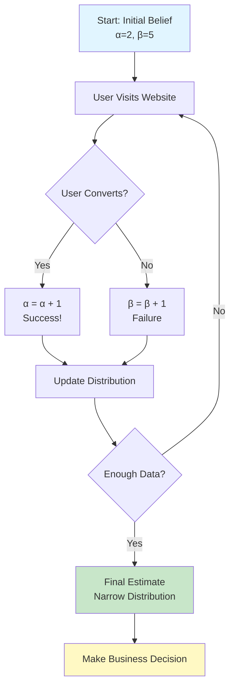

# Coding Guide: PD2 Assignment Solution

## Overview
This assignment explores two advanced applications of probability distributions:
1. **T-Distribution**: Understanding how sample size affects the t-distribution
2. **Dynamic Beta Distribution**: Simulating evolving conversion rates for a website

---

## Problem 1: Exploring the Impact of Sample Size on T-Distribution

### Concept
The t-distribution is similar to the normal (Z) distribution but has **heavier tails**, meaning more probability in the extremes. As sample size increases, the t-distribution approaches the normal distribution.

### Why This Matters
- **Small samples** (n < 30): Use t-distribution (more uncertainty)
- **Large samples** (n ≥ 30): Can use normal distribution (less uncertainty)
- Understanding this helps in hypothesis testing and confidence intervals

---

### Code Implementation

#### Step 1: Import Libraries

```python
import numpy as np
import matplotlib.pyplot as plt
from scipy.stats import t, norm
```

**Libraries Explained**:
- **`numpy`**: For numerical operations and random number generation
- **`matplotlib.pyplot`**: For creating visualizations
- **`scipy.stats.t`**: T-distribution functions
- **`scipy.stats.norm`**: Normal distribution functions

---

#### Step 2: Set Parameters

```python
# Parameters
sample_sizes = [5, 7, 10, 15, 30]  # Different sample sizes to test
num_samples = 100000  # Number of samples to generate (N)
```

**Key Parameters**:
- **`sample_sizes`**: List of different sample sizes to investigate
  - Small (5, 7): Heavy tails
  - Medium (10, 15): Moderate tails
  - Large (30): Approaches normal distribution
- **`num_samples`**: Large number ensures accurate distribution shape

---

#### Step 3: Generate T-Distribution Samples

```python
# Generate samples for each sample size
for n in sample_sizes:
    # Degrees of freedom = sample size - 1
    df = n - 1
    
    # Generate random samples from t-distribution
    samples = t.rvs(df, size=num_samples)
    
    # Plot histogram
    plt.hist(samples, bins=100, density=True, alpha=0.5, 
             label=f'n={n} (df={df})')
```

**Key Concepts**:
- **Degrees of Freedom (df)**: `n - 1` where n is sample size
  - Lower df = heavier tails
  - Higher df = closer to normal distribution
- **`t.rvs(df, size=num_samples)`**: Generate random samples
  - `df`: Degrees of freedom parameter
  - `size`: Number of samples to generate
- **`density=True`**: Normalize histogram to show probability density
- **`alpha=0.5`**: Transparency to see overlapping distributions

---

#### Step 4: Overlay Normal Distribution

```python
# Generate x-axis values
x = np.linspace(-4, 4, 1000)

# Plot standard normal distribution (Z-distribution)
plt.plot(x, norm.pdf(x, 0, 1), 'k-', linewidth=2, 
         label='Standard Normal (Z)')

plt.xlabel('Value')
plt.ylabel('Probability Density')
plt.title('T-Distribution vs Normal Distribution')
plt.legend()
plt.grid(True)
plt.show()
```

**Visualization Components**:
- **`np.linspace(-4, 4, 1000)`**: Create 1000 evenly spaced points from -4 to 4
- **`norm.pdf(x, 0, 1)`**: Standard normal PDF (mean=0, std=1)
- **`'k-'`**: Black solid line
- **`linewidth=2`**: Thicker line for emphasis

---

### Expected Results

```
📊 Visual Observations:

Sample Size = 5 (df=4):
- Widest distribution
- Heaviest tails
- Most spread out

Sample Size = 10 (df=9):
- Narrower than n=5
- Still noticeable tails

Sample Size = 30 (df=29):
- Very close to normal distribution
- Minimal difference from Z-distribution

🎯 Key Insight: As n increases, t-distribution → Normal distribution
```

---

### Analysis Points

1. **Decrease in Variability**: 
   - Larger sample size → Less spread
   - More concentrated around mean

2. **Convergence to Normal**:
   - At n=30, t-distribution ≈ normal distribution
   - This is why n≥30 is often used as threshold

3. **Practical Implication**:
   - Small samples: Must use t-distribution for accurate inference
   - Large samples: Can use normal distribution (simpler calculations)

---

## Problem 2: Simulating Dynamic Conversion Rates

### Concept
Model a website's conversion rate that evolves over time as more users interact with it. Uses **Beta distribution** because conversion rates are proportions (0 to 1).

### Real-World Application
- **E-commerce**: Track purchase conversion rate
- **Marketing**: Monitor email click-through rate
- **Product**: Measure feature adoption rate

---

### Code Implementation

#### Step 1: Initialize Parameters

```python
import numpy as np
import matplotlib.pyplot as plt
from scipy.stats import beta

# Initial parameters
initial_alpha = 2  # Initial successes + 1
initial_beta = 5   # Initial failures + 1
num_time_steps = 100  # Number of updates to simulate
```

**Beta Distribution Parameters**:
- **`alpha`**: Related to number of successes
  - Higher alpha → distribution shifts right (higher conversion)
- **`beta`**: Related to number of failures
  - Higher beta → distribution shifts left (lower conversion)
- **Initial values**: Represent prior belief before seeing data

**Interpretation**:
- `alpha=2, beta=5` suggests we initially believe conversion rate is around 2/(2+5) ≈ 28.6%

---

#### Step 2: Simulate User Interactions

```python
# Storage for parameters over time
alpha_values = [initial_alpha]
beta_values = [initial_beta]

# Simulate user interactions
for step in range(1, num_time_steps + 1):
    # Simulate user interaction (1 = conversion, 0 = no conversion)
    # Assume true conversion rate of 0.3 (30%)
    user_converted = np.random.rand() < 0.3
    
    # Update parameters based on outcome
    if user_converted:
        alpha_values.append(alpha_values[-1] + 1)  # Success
        beta_values.append(beta_values[-1])
    else:
        alpha_values.append(alpha_values[-1])
        beta_values.append(beta_values[-1] + 1)  # Failure
```

**Key Concepts**:
- **`np.random.rand()`**: Generate random number between 0 and 1
- **`< 0.3`**: True 30% of the time (simulates 30% conversion rate)
- **Bayesian Update**:
  - Success: `alpha += 1`
  - Failure: `beta += 1`
  - This is how we "learn" from data

**Why This Works**:
- Each user interaction provides new information
- Beta distribution naturally updates with new data
- Parameters accumulate evidence over time

---

#### Step 3: Visualize Evolution

```python
# Create subplots for different time steps
fig, axes = plt.subplots(2, 3, figsize=(15, 10))
time_steps_to_plot = [1, 10, 25, 50, 75, 100]

for idx, step in enumerate(time_steps_to_plot):
    ax = axes[idx // 3, idx % 3]
    
    # Get parameters at this time step
    alpha = alpha_values[step]
    beta_param = beta_values[step]
    
    # Generate x values (possible conversion rates)
    x = np.linspace(0, 1, 1000)
    
    # Calculate PDF
    pdf = beta.pdf(x, alpha, beta_param)
    
    # Plot
    ax.plot(x, pdf, 'b-', linewidth=2)
    ax.fill_between(x, pdf, alpha=0.3)
    ax.set_title(f'Time Step {step}: α={alpha}, β={beta_param}')
    ax.set_xlabel('Conversion Rate')
    ax.set_ylabel('Probability Density')
    ax.grid(True)

plt.tight_layout()
plt.show()
```

**Visualization Breakdown**:
- **`subplots(2, 3)`**: Create 2x3 grid of plots
- **`time_steps_to_plot`**: Show snapshots at key moments
- **`idx // 3, idx % 3`**: Calculate subplot position
- **`fill_between`**: Shade area under curve for better visualization

---

### Expected Evolution Pattern

```
📈 Distribution Evolution:

Time Step 1 (α=2, β=5):
- Wide distribution
- Peak around 0.28
- High uncertainty

Time Step 10 (α≈5, β≈12):
- Slightly narrower
- Peak moving toward true rate (0.3)
- Moderate uncertainty

Time Step 50 (α≈17, β≈38):
- Much narrower
- Peak very close to 0.3
- Low uncertainty

Time Step 100 (α≈32, β≈73):
- Very narrow
- Peak at ~0.3
- Very low uncertainty

🎯 Key Insight: More data → More confidence → Narrower distribution
```

---

## Problem 3: Insights from Dynamic Beta Simulation

### Key Insights

#### 1. Initial Conversion Rate Assessment
```
At time step 1:
- Distribution is wide (high uncertainty)
- Peak represents our initial belief
- We're not very confident yet
```

#### 2. Learning from Data
```
As time progresses:
- Distribution becomes narrower (less uncertainty)
- Peak moves toward true conversion rate
- We become more confident in our estimate
```

#### 3. Convergence to True Rate
```
After many observations:
- Distribution tightly centered around true rate (0.3)
- Very little uncertainty remaining
- Predictions become highly accurate
```

#### 4. Practical Applications

**A/B Testing**:
```python
# Compare two versions
version_a_alpha, version_a_beta = 50, 150  # 25% conversion
version_b_alpha, version_b_beta = 60, 140  # 30% conversion

# Which is better?
# Calculate probability that B > A
samples_a = beta.rvs(version_a_alpha, version_a_beta, size=10000)
samples_b = beta.rvs(version_b_alpha, version_b_beta, size=10000)
prob_b_better = np.mean(samples_b > samples_a)
print(f"Probability B is better: {prob_b_better:.2%}")
```

**Early Stopping**:
```python
# Stop test early if confidence is high enough
if prob_b_better > 0.95:  # 95% confident
    print("Version B is significantly better!")
```

---

## Mermaid Diagram: Dynamic Beta Distribution Workflow



---

## Complete Code Example: Putting It All Together

```python
import numpy as np
import matplotlib.pyplot as plt
from scipy.stats import beta

def simulate_conversion_tracking(true_rate=0.3, num_steps=100):
    """
    Simulate dynamic conversion rate tracking
    
    Parameters:
    -----------
    true_rate : float
        True conversion rate (0 to 1)
    num_steps : int
        Number of user interactions to simulate
    
    Returns:
    --------
    alpha_values, beta_values : lists
        Evolution of distribution parameters
    """
    # Initialize
    alpha_values = [2]  # Prior: 2 successes
    beta_values = [5]   # Prior: 5 failures
    
    # Simulate
    for _ in range(num_steps):
        # User interaction
        converted = np.random.rand() < true_rate
        
        # Update
        if converted:
            alpha_values.append(alpha_values[-1] + 1)
            beta_values.append(beta_values[-1])
        else:
            alpha_values.append(alpha_values[-1])
            beta_values.append(beta_values[-1] + 1)
    
    return alpha_values, beta_values

def plot_evolution(alpha_values, beta_values, steps_to_show=[1, 25, 50, 100]):
    """Plot distribution evolution at key time steps"""
    fig, axes = plt.subplots(2, 2, figsize=(12, 10))
    
    for idx, step in enumerate(steps_to_show):
        ax = axes[idx // 2, idx % 2]
        
        # Get parameters
        a = alpha_values[step]
        b = beta_values[step]
        
        # Plot
        x = np.linspace(0, 1, 1000)
        ax.plot(x, beta.pdf(x, a, b), 'b-', linewidth=2)
        ax.fill_between(x, beta.pdf(x, a, b), alpha=0.3)
        
        # Calculate mean and std
        mean = a / (a + b)
        std = np.sqrt((a * b) / ((a + b)**2 * (a + b + 1)))
        
        ax.set_title(f'Step {step}: α={a}, β={b}\n'
                    f'Mean={mean:.3f}, Std={std:.3f}')
        ax.set_xlabel('Conversion Rate')
        ax.set_ylabel('Density')
        ax.grid(True, alpha=0.3)
    
    plt.tight_layout()
    plt.show()

# Run simulation
alpha_vals, beta_vals = simulate_conversion_tracking(true_rate=0.3, num_steps=100)
plot_evolution(alpha_vals, beta_vals)
```

---

## Key Formulas

### Beta Distribution Mean and Variance

```python
# Mean (expected value)
mean = alpha / (alpha + beta)

# Variance
variance = (alpha * beta) / ((alpha + beta)**2 * (alpha + beta + 1))

# Standard deviation
std = np.sqrt(variance)
```

### Credible Interval (Bayesian Confidence Interval)

```python
# 95% credible interval
lower = beta.ppf(0.025, alpha, beta)
upper = beta.ppf(0.975, alpha, beta)

print(f"95% Credible Interval: [{lower:.3f}, {upper:.3f}]")
```

---

## Practice Exercises

### Exercise 1: T-Distribution
1. Generate t-distributions with df = [3, 10, 30, 100]
2. Compare with normal distribution
3. Calculate the probability P(|X| > 2) for each

### Exercise 2: Beta Distribution
1. Start with α=1, β=1 (uniform prior)
2. Simulate 200 user interactions with 40% true conversion rate
3. Plot evolution at steps [1, 50, 100, 150, 200]
4. Calculate final mean and 95% credible interval

### Exercise 3: A/B Testing
1. Simulate two versions:
   - Version A: 25% conversion (100 users)
   - Version B: 30% conversion (100 users)
2. Calculate probability that B is better than A
3. Determine minimum sample size for 95% confidence

---

## Common Pitfalls to Avoid

1. **Forgetting df = n - 1**: Degrees of freedom is sample size minus 1
2. **Not using density=True**: Histograms won't match PDF curves
3. **Confusing alpha/beta**: Alpha for successes, beta for failures
4. **Ignoring prior**: Initial values matter, especially with little data
5. **Stopping too early**: Need enough data for reliable conclusions

---

## Key Takeaways

### T-Distribution
- ✅ Use for small samples (n < 30)
- ✅ Heavier tails than normal distribution
- ✅ Converges to normal as sample size increases
- ✅ Critical for hypothesis testing with limited data

### Dynamic Beta Distribution
- ✅ Perfect for modeling proportions that evolve
- ✅ Naturally incorporates prior beliefs
- ✅ Updates smoothly with new data
- ✅ Provides uncertainty quantification
- ✅ Essential for Bayesian A/B testing

---

## Additional Resources

- Main Notebook Guide: `[Mar_16]_Probability_Distribution_2_CODING_GUIDE.md`
- Study Guide: `meeting_saved_closed_caption_STUDY_GUIDE.md`
- scipy.stats documentation: https://docs.scipy.org/doc/scipy/reference/stats.html
- Bayesian A/B Testing: https://www.evanmiller.org/bayesian-ab-testing.html

