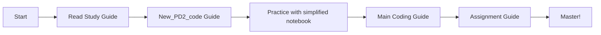
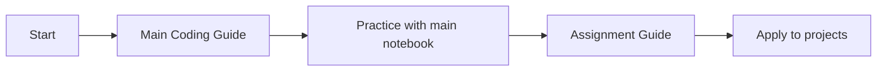

# Week 7 - Probability Distributions 2: Guide Summary

## 📚 All Guides Created

This folder now contains comprehensive learning materials for Week 7. Here's what's available:

---

## 🎯 Coding Guides

### 1. **[Mar_16]_Probability_Distribution_2_CODING_GUIDE.md** ⭐ MAIN GUIDE
**Status**: ✅ Created
**Content**: Comprehensive guide covering:
- Uniform Distribution (basic and visualization)
- Beta Distribution (with 3 fitting methods)
  - scipy.stats.fit()
  - KL Divergence optimization
  - Optuna hyperparameter tuning
- Normal Distribution (with outlier detection)
- Multivariate Normal Distribution
- t-Distribution
- Complete code examples with detailed explanations
- Mermaid workflow diagram
- Practice exercises

**Best For**: 
- Complete understanding of all distributions
- Learning advanced fitting techniques
- Real-world data analysis

---

### 2. **New_PD2_code_CODING_GUIDE.md** 📖 SIMPLIFIED GUIDE
**Status**: ✅ Created
**Content**: Condensed version focusing on:
- Basic distribution implementations
- Core concepts without fitting methods
- Quick reference code snippets
- Comparison table with main notebook

**Best For**:
- Quick reference
- Beginners learning fundamentals
- When you don't need distribution fitting

---

### 3. **PD2_Assignment_Solution_CODING_GUIDE.md** 🎓 ASSIGNMENT GUIDE
**Status**: ✅ Created
**Content**: Detailed solutions for:
- **Problem 1**: T-Distribution and sample size impact
  - Understanding degrees of freedom
  - Convergence to normal distribution
  - Practical implications
- **Problem 2**: Dynamic Beta Distribution simulation
  - Modeling evolving conversion rates
  - Bayesian updating
  - Real-world applications (A/B testing)
- **Problem 3**: Insights and analysis
- Complete working code examples
- Practice exercises

**Best For**:
- Understanding assignment solutions
- Learning Bayesian methods
- A/B testing applications

---

## 📖 Study Guide

### 4. **meeting_saved_closed_caption_STUDY_GUIDE.md** 📝 CONCEPTUAL GUIDE
**Status**: ✅ Already exists (verified up-to-date)
**Content**: Comprehensive study material with:
- Simple explanations (like explaining to a 12-year-old)
- Technical concepts
- Major points from class notes
- Interview questions with detailed answers
- Concise summaries

**Best For**:
- Understanding theory
- Exam preparation
- Interview preparation

---

## 🗂️ File Organization

```
Week 7 - Probability Distributions 2/
├── 📓 Notebooks
│   ├── [Mar_16]_Probability_Distribution_2.ipynb (Main notebook)
│   ├── New_PD2_code.ipynb (Simplified version)
│   └── PD2_Assignment_Solution.ipynb (Assignment solutions)
│
├── 📚 Coding Guides
│   ├── [Mar_16]_Probability_Distribution_2_CODING_GUIDE.md ⭐
│   ├── New_PD2_code_CODING_GUIDE.md
│   └── PD2_Assignment_Solution_CODING_GUIDE.md
│
├── 📖 Study Materials
│   ├── meeting_saved_closed_caption_STUDY_GUIDE.md
│   ├── meeting_saved_closed_caption.txt (Original transcript)
│   └── README_GUIDES.md (This file)
│
└── 📄 Reference Materials
    └── [Mar16] PD2_Slides [Annotated].pdf
```

---

## 🎯 Learning Path Recommendation

### For Beginners:


### For Advanced Learners:


---

## 📊 Content Comparison

| Feature | Main Guide | Simplified Guide | Assignment Guide | Study Guide |
|---------|-----------|------------------|------------------|-------------|
| **Distributions Covered** | 5 types | 5 types | 2 types (focus) | All types |
| **Code Examples** | ✅ Extensive | ✅ Basic | ✅ Advanced | ❌ Theory only |
| **Fitting Methods** | ✅ 3 methods | ❌ None | ✅ Bayesian | ❌ N/A |
| **Visualizations** | ✅ Yes | ✅ Yes | ✅ Yes | ✅ Conceptual |
| **Practice Exercises** | ✅ Yes | ✅ Yes | ✅ Yes | ❌ No |
| **Interview Prep** | ❌ No | ❌ No | ❌ No | ✅ Yes |
| **Difficulty Level** | Advanced | Beginner | Intermediate | All levels |

---

## 🔑 Key Topics Covered

### Distributions
- ✅ Uniform Distribution
- ✅ Beta Distribution
- ✅ Normal (Gaussian) Distribution
- ✅ Multivariate Normal Distribution
- ✅ t-Distribution (Student's t)

### Techniques
- ✅ Random sample generation (`rvs`)
- ✅ Probability density function (`pdf`)
- ✅ Cumulative distribution function (`cdf`)
- ✅ Percent point function (`ppf`)
- ✅ Distribution fitting (`fit`)
- ✅ KL Divergence optimization
- ✅ Optuna hyperparameter tuning
- ✅ Bayesian updating
- ✅ Outlier detection (z-scores)

### Applications
- ✅ Air quality modeling
- ✅ Conversion rate tracking
- ✅ A/B testing
- ✅ Sample size analysis
- ✅ Hypothesis testing

---

## 💡 Quick Start Guide

### I want to understand the basics:
👉 Start with: `New_PD2_code_CODING_GUIDE.md`

### I want comprehensive knowledge:
👉 Start with: `[Mar_16]_Probability_Distribution_2_CODING_GUIDE.md`

### I want to solve the assignment:
👉 Start with: `PD2_Assignment_Solution_CODING_GUIDE.md`

### I want to prepare for exams/interviews:
👉 Start with: `meeting_saved_closed_caption_STUDY_GUIDE.md`

### I want to learn distribution fitting:
👉 Start with: Main guide, Section on Beta Distribution fitting

### I want to learn Bayesian methods:
👉 Start with: Assignment guide, Problem 2

---

## 🎓 Study Tips

1. **Don't rush**: Start with simpler guides before advanced ones
2. **Practice coding**: Type out examples, don't just read
3. **Modify examples**: Change parameters and observe results
4. **Use visualizations**: Plots help understand distributions
5. **Connect concepts**: See how distributions relate to each other
6. **Apply to projects**: Use real data to practice

---

## 🔗 Related Resources

### Within This Folder:
- All coding guides (see above)
- Study guide for theory
- Original notebooks for hands-on practice

### External Resources:
- scipy.stats documentation: https://docs.scipy.org/doc/scipy/reference/stats.html
- Optuna documentation: https://optuna.readthedocs.io/
- Bayesian A/B Testing: https://www.evanmiller.org/bayesian-ab-testing.html

---

## ✅ Verification Checklist

Use this to track your progress:

### Coding Guides
- [ ] Read Main Coding Guide
- [ ] Completed practice exercises from Main Guide
- [ ] Read Simplified Coding Guide
- [ ] Read Assignment Solution Guide
- [ ] Completed assignment practice exercises

### Notebooks
- [ ] Ran main notebook successfully
- [ ] Ran simplified notebook successfully
- [ ] Ran assignment solution notebook successfully
- [ ] Modified examples and experimented

### Concepts
- [ ] Understand Uniform Distribution
- [ ] Understand Beta Distribution
- [ ] Understand Normal Distribution
- [ ] Understand Multivariate Normal
- [ ] Understand t-Distribution
- [ ] Can fit distributions to data
- [ ] Understand Bayesian updating

### Applications
- [ ] Can model proportions with Beta
- [ ] Can detect outliers with z-scores
- [ ] Can perform A/B testing
- [ ] Can analyze sample size effects

---

## 🆘 Need Help?

### Common Issues:

**Q: Which guide should I start with?**
A: If you're new to Python ML, start with the Simplified Guide. Otherwise, start with the Main Guide.

**Q: The code doesn't run!**
A: Make sure you have installed: `scipy`, `numpy`, `matplotlib`, and `optuna` (for advanced examples)

**Q: I don't understand the math**
A: Start with the Study Guide for conceptual understanding, then move to coding guides.

**Q: How do I know if I've mastered this?**
A: Complete all practice exercises and try applying concepts to a real dataset.

---

## 📝 Notes

- All guides are designed for learners new to Python programming
- Code examples are fully explained with comments
- Mermaid diagrams included for visual learners
- Practice exercises provided for hands-on learning
- Real-world applications emphasized throughout

---

## 🎉 Congratulations!

You now have a complete set of learning materials for Week 7. Take your time, practice regularly, and don't hesitate to revisit guides as needed. Happy learning! 🚀

