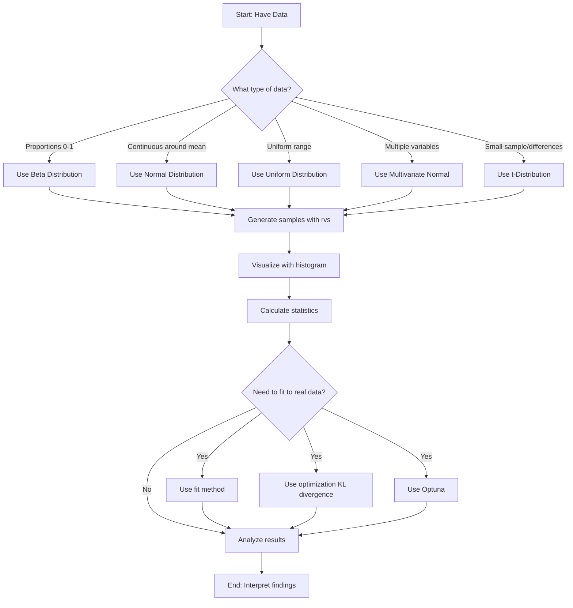

# Coding Guide: Probability Distribution 2 - Environmental Air Quality Case Study

## Overview
This notebook demonstrates various continuous probability distributions through a real-world case study analyzing air quality data. You'll learn how to model environmental data using different statistical distributions.

## Case Study Context
**Scenario**: Environmental Research on Air Quality
- **Goal**: Analyze air quality and related environmental factors in a city
- **Distributions Covered**: Uniform, Beta, Normal, Multivariate Normal, and t-Distribution
- **Application**: Modeling PM2.5 concentrations, measurement times, temperature, humidity relationships

---

## 1. Library Imports

### Why These Libraries?

```python
from scipy.stats import uniform, beta, norm, multivariate_normal, t
from matplotlib import pyplot as plt
import numpy as np
```

**Purpose of Each Import**:
- **`scipy.stats`**: Contains all discrete and continuous probability distributions with methods for:
  - `rvs()`: Generate random samples (Random Variates)
  - `pdf()`: Probability Density Function
  - `cdf()`: Cumulative Distribution Function
  - `ppf()`: Percent Point Function (inverse of CDF)
  - `fit()`: Fit distribution parameters to data

- **`matplotlib.pyplot`**: For visualizing distributions and data
- **`numpy`**: For numerical operations and array handling

---

## 2. Uniform Distribution

### Concept
Models events that are equally likely to occur across a range (e.g., measurement times throughout a 24-hour period).

### Code Example 1: Basic Uniform Distribution

```python
from scipy.stats import uniform

# Parameters
low_uniform = 0      # Minimum value (midnight)
high_uniform = 24    # Maximum value (next midnight)

# Generate 1000 random samples
measurement_times = uniform.rvs(low_uniform, high_uniform - low_uniform, size=1000)
```

**Key Arguments**:
- **`loc`** (first argument): Minimum value of the distribution
- **`scale`** (second argument): Range of the distribution (max - min)
- **`size`**: Number of random samples to generate

**Important**: For uniform distribution, `scale = high - low`, NOT just the high value!

### Code Example 2: Visualization

```python
# View first 5 samples
measurement_times[:5]

# Create histogram
plt.hist(measurement_times, bins=24, density=True, alpha=0.6, 
         color='b', edgecolor='black')
plt.title('Uniform Distribution of Measurement Times')
plt.xlabel('Time of Day (hours)')
plt.ylabel('Density')

# Calculate statistics
print(f"Mean: {np.mean(measurement_times)}")
print(f"Range: ({min(measurement_times)}, {max(measurement_times)})")
```

**Histogram Arguments**:
- **`bins=24`**: Divide data into 24 groups (one per hour)
- **`density=True`**: Normalize to show probability density (area = 1)
- **`alpha=0.6`**: Transparency level (0=transparent, 1=opaque)
- **`edgecolor='black'`**: Border color for bars

---

## 3. Beta Distribution

### Concept
Models proportions/percentages (values between 0 and 1). Perfect for modeling "proportion of days with good air quality".

### Understanding Beta Parameters
- **`a` (alpha)**: Shape parameter 1
- **`b` (beta)**: Shape parameter 2
- Different combinations create different shapes:
  - `a=b`: Symmetric distribution
  - `a>b`: Skewed right (more values near 1)
  - `a<b`: Skewed left (more values near 0)

### Code Example 1: Generating Beta Data

```python
from scipy.stats import beta

# Parameters
a = 2  # Alpha parameter
b = 5  # Beta parameter

# Generate samples
good_air_quality_days = beta.rvs(a, b, size=1000)
```

### Code Example 2: Beta Distribution Functions

```python
# PDF: Probability Density at a specific point
probability_density = beta.pdf(0.3, a, b)

# CDF: Cumulative probability up to a point
cumulative_prob = beta.cdf(0.6, a, b)

# Probability of value > 0.6
prob_greater_than_06 = 1 - beta.cdf(0.6, a, b)

# PPF: Find value at specific percentile
value_at_60th_percentile = beta.ppf(0.6, a=2, b=5)
```

**Function Explanations**:
- **`pdf(x, a, b)`**: Returns probability density at point x
- **`cdf(x, a, b)`**: Returns P(X ≤ x)
- **`ppf(q, a, b)`**: Returns x where P(X ≤ x) = q (inverse of CDF)

### Code Example 3: Fitting Beta Distribution to Real Data

#### Method 1: Using scipy's built-in fit()

```python
# Real observed data (proportions)
real_data = np.array([0.3, 0.4, 0.35, 0.5, 0.45, 0.6, 0.55, 0.4, 0.5, 0.45])

# Fit beta distribution to data
fitted_a, fitted_b, loc, scale = beta.fit(real_data, floc=0, fscale=1)

print(f"Fitted alpha: {fitted_a}")
print(f"Fitted beta: {fitted_b}")
```

**`fit()` Arguments**:
- **`floc=0`**: Fix location parameter at 0
- **`fscale=1`**: Fix scale parameter at 1
- Returns: (alpha, beta, location, scale)

#### Method 2: Manual Optimization with KL Divergence

```python
from scipy.optimize import minimize
from scipy.special import kl_div

def kl_divergence_beta(params, real_data):
    """Calculate KL divergence between real data and beta distribution"""
    a, b = params
    
    # Create histogram of real data
    hist, bin_edges = np.histogram(real_data, bins=30, density=True)
    bin_centers = (bin_edges[:-1] + bin_edges[1:]) / 2
    
    # Get beta PDF values
    beta_pdf = beta.pdf(bin_centers, a, b)
    
    # Calculate KL divergence
    kl_div_value = np.sum(kl_div(hist, beta_pdf))
    return kl_div_value

# Initial guess for parameters
initial_guess = [2, 5]

# Optimize
result = minimize(kl_divergence_beta, initial_guess, args=(real_data,), 
                  method='L-BFGS-B', bounds=[(0.1, 10), (0.1, 10)])

optimal_a, optimal_b = result.x
```

**Key Concepts**:
- **KL Divergence**: Measures how one probability distribution differs from another
- **`minimize()`**: Finds parameters that minimize the divergence
- **`bounds`**: Constrains parameters to reasonable ranges

#### Method 3: Using Optuna for Hyperparameter Optimization

```python
import optuna

def objective(trial):
    """Optuna objective function"""
    # Suggest parameter values
    a = trial.suggest_float('a', 0.1, 10)
    b = trial.suggest_float('b', 0.1, 10)
    
    # Calculate KL divergence
    hist, bin_edges = np.histogram(real_data, bins=30, density=True)
    bin_centers = (bin_edges[:-1] + bin_edges[1:]) / 2
    beta_pdf = beta.pdf(bin_centers, a, b)
    kl_div_value = np.sum(kl_div(hist, beta_pdf))
    
    return kl_div_value

# Create study and optimize
study = optuna.create_study(direction='minimize')
study.optimize(objective, n_trials=100)

# Get best parameters
best_a = study.best_params['a']
best_b = study.best_params['b']
```

**Optuna Advantages**:
- Automatic hyperparameter tuning
- Multiple optimization algorithms
- Easy to use and visualize results

---

## 4. Normal (Gaussian) Distribution

### Concept
The most common distribution in nature. Models data that clusters around a mean value (e.g., PM2.5 concentrations).

### Code Example: Normal Distribution

```python
from scipy.stats import norm

# Parameters
mean_pm25 = 50      # Mean PM2.5 concentration
std_pm25 = 15       # Standard deviation

# Generate samples
pm25_concentrations = norm.rvs(mean_pm25, std_pm25, size=1000)

# Visualization
plt.hist(pm25_concentrations, bins=30, density=True, alpha=0.6, 
         color='g', edgecolor='black')

# Overlay theoretical PDF
x = np.linspace(0, 100, 1000)
plt.plot(x, norm.pdf(x, mean_pm25, std_pm25), 'r-', linewidth=2, 
         label='Theoretical PDF')
plt.legend()
```

### Outlier Detection Using Z-Score

```python
# Calculate z-scores (standardization)
z_scores = (pm25_concentrations - mean_pm25) / std_pm25

# Identify outliers (|z| > 3)
outliers = pm25_concentrations[np.abs(z_scores) > 3]

print(f"Number of outliers: {len(outliers)}")
```

**Z-Score Formula**: `z = (x - μ) / σ`
- **μ (mu)**: Mean
- **σ (sigma)**: Standard deviation
- **Interpretation**: How many standard deviations away from the mean
- **Rule of Thumb**: |z| > 3 indicates potential outlier

---

## 5. Multivariate Normal Distribution

### Concept
Models multiple related variables simultaneously (e.g., temperature, humidity, and PM2.5 together).

### Code Example

```python
from scipy.stats import multivariate_normal

# Mean values for [Temperature, Humidity, PM2.5]
mean_multivariate = [25, 60, 50]

# Covariance matrix (shows relationships between variables)
cov_multivariate = [
    [10, 5, 2],    # Temperature variances and covariances
    [5, 15, 3],    # Humidity variances and covariances
    [2, 3, 20]     # PM2.5 variances and covariances
]

# Generate samples
multivariate_samples = multivariate_normal.rvs(
    mean=mean_multivariate, 
    cov=cov_multivariate, 
    size=1000
)

# Extract individual variables
temperature = multivariate_samples[:, 0]
humidity = multivariate_samples[:, 1]
pm25 = multivariate_samples[:, 2]
```

**Covariance Matrix Explained**:
- **Diagonal elements**: Variances of each variable
- **Off-diagonal elements**: Covariances (relationships) between variables
- **Positive covariance**: Variables increase together
- **Negative covariance**: One increases as other decreases

---

## 6. t-Distribution (Student's t)

### Concept
Similar to normal distribution but with heavier tails. Used when sample size is small or when dealing with differences between groups.

### Code Example

```python
from scipy.stats import t

# Parameters
df = 10  # Degrees of freedom (related to sample size)
mean_diff = 5
std_diff = 3

# Generate samples (differences between weekday and weekend PM2.5)
pm25_diff = t.rvs(df, loc=mean_diff, scale=std_diff, size=1000)

# Visualization
plt.hist(pm25_diff, bins=30, density=True, alpha=0.6, 
         color='purple', edgecolor='black')

# Overlay t-distribution PDF
x = np.linspace(-10, 20, 1000)
plt.plot(x, t.pdf(x, df, loc=mean_diff, scale=std_diff), 
         'r-', linewidth=2, label='t-Distribution PDF')
plt.legend()
```

**Key Parameters**:
- **`df`** (degrees of freedom): Controls tail heaviness
  - Lower df = heavier tails
  - Higher df → approaches normal distribution
- **`loc`**: Location parameter (similar to mean)
- **`scale`**: Scale parameter (similar to standard deviation)

---

## Key Takeaways

### Distribution Selection Guide

| Distribution | Use When | Example |
|--------------|----------|---------|
| **Uniform** | All outcomes equally likely | Measurement times, random selection |
| **Beta** | Modeling proportions (0-1) | Success rates, percentages |
| **Normal** | Data clusters around mean | Heights, test scores, measurements |
| **Multivariate Normal** | Multiple related variables | Temperature + Humidity + PM2.5 |
| **t-Distribution** | Small samples or group differences | Comparing weekday vs weekend data |

### Common scipy.stats Methods

```python
# For any distribution 'dist':
dist.rvs()      # Generate random samples
dist.pdf(x)     # Probability density at x
dist.cdf(x)     # Cumulative probability P(X ≤ x)
dist.ppf(q)     # Inverse CDF (quantile function)
dist.fit(data)  # Fit distribution to data
```

---

## Mermaid Diagram: Workflow for Distribution Analysis



---

## Practice Exercises

1. **Generate and visualize** a uniform distribution for temperatures between 15°C and 35°C
2. **Fit a beta distribution** to this data: [0.2, 0.3, 0.4, 0.5, 0.6, 0.7, 0.3, 0.4, 0.5]
3. **Calculate the probability** that PM2.5 > 70 given mean=50, std=15 (normal distribution)
4. **Create a multivariate distribution** for [Wind Speed, Temperature, Humidity]
5. **Compare** normal vs t-distribution with df=5 visually

---

## Common Pitfalls to Avoid

1. **Uniform Distribution**: Remember `scale = high - low`, not just `high`
2. **Beta Distribution**: Parameters must be positive (a > 0, b > 0)
3. **Histogram**: Use `density=True` when comparing with PDF curves
4. **Covariance Matrix**: Must be symmetric and positive semi-definite
5. **t-Distribution**: Don't confuse degrees of freedom with sample size

---

## Additional Resources

- [Beta Distribution Visual Guide](https://drive.google.com/file/d/1XvC_LYa6CS7TyA32LZWDNKKj7TipohSr/view?usp=sharing)
- scipy.stats documentation: https://docs.scipy.org/doc/scipy/reference/stats.html
- Understanding KL Divergence: Measures difference between probability distributions

