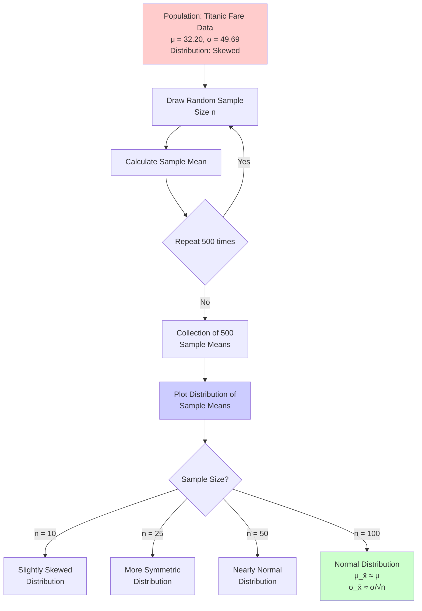

# Coding Guide: Central Limit Theorem (CLT) Demo

## Overview
This notebook demonstrates the Central Limit Theorem using the Titanic dataset's Fare column. It shows how sample means approximate a normal distribution as sample size increases.

---

## Library Imports

### pandas (pd)
```python
import pandas as pd
```
**Purpose**: Data manipulation and analysis library
- Used for reading CSV files and working with DataFrames
- Provides Series and DataFrame objects for structured data

### numpy (np)
```python
import numpy as np
```
**Purpose**: Numerical computing library
- Provides support for arrays and mathematical operations
- Used for statistical calculations

### matplotlib.pyplot (plt)
```python
import matplotlib.pyplot as plt
```
**Purpose**: Data visualization library
- Creates static, animated, and interactive visualizations
- Used to plot histograms and distributions

### seaborn (sns)
```python
import seaborn as sns
```
**Purpose**: Statistical data visualization library built on matplotlib
- Provides high-level interface for attractive statistical graphics
- Used for enhanced histogram plotting with KDE (Kernel Density Estimation)

---

## Data Loading

```python
df = pd.read_csv('titanic.csv')
```
**What it does**: Loads the Titanic dataset from a CSV file into a pandas DataFrame

**Key Points**:
- `pd.read_csv()` reads CSV files and returns a DataFrame
- The DataFrame `df` contains passenger information including fares paid

---

## Data Exploration

### Viewing Data
```python
df.head(5)
```
**Purpose**: Displays the first 5 rows of the dataset
- Helps understand the structure and content of the data
- Shows column names and sample values

### Dataset Shape
```python
df.shape
```
**Returns**: A tuple `(rows, columns)` - in this case `(891, 12)`
- 891 passengers (rows)
- 12 features/columns

### Dataset Information
```python
df.info()
```
**Purpose**: Provides a concise summary of the DataFrame
- Shows column names, data types, and non-null counts
- Helps identify missing values
- Displays memory usage

---

## Population Statistics

### Population Mean
```python
df['Fare'].mean()
```
**Returns**: `32.204207968574636`
- Calculates the average fare paid by all passengers
- This is the **population mean** (μ)

### Population Standard Deviation
```python
df['Fare'].std()
```
**Returns**: `49.6934285971809`
- Measures the spread of fare values around the mean
- This is the **population standard deviation** (σ)

---

## Visualizing Population Distribution

```python
plt.hist(df['Fare'])
```
**Purpose**: Creates a histogram of the Fare column
- Shows the distribution is heavily right-skewed
- Most fares are between 0-100
- Some outliers exist around 250-300 and 500

**Key Observation**: The original population distribution is NOT normal - it's skewed!

---

## Central Limit Theorem Demonstration

### Sampling Experiment Setup

```python
num_samples = 500
sample_sizes = [10, 25, 50, 100]
```
**Parameters**:
- `num_samples`: Number of samples to draw (500)
- `sample_sizes`: Different sample sizes to test the CLT

### Sample Mean Collection Function

```python
def plot_sample_means_distribution(sample_size, ax):
    sample_means = []
    for _ in range(num_samples):
        sample = df['Fare'].dropna().sample(n=sample_size, replace=True)
        sample_mean = sample.mean()
        sample_means.append(sample_mean)
```

**Step-by-Step Breakdown**:

1. **Initialize empty list**:
   ```python
   sample_means = []
   ```
   - Stores the mean of each sample

2. **Loop 500 times**:
   ```python
   for _ in range(num_samples):
   ```
   - Creates 500 different samples

3. **Draw random sample**:
   ```python
   sample = df['Fare'].dropna().sample(n=sample_size, replace=True)
   ```
   - `dropna()`: Removes missing values
   - `sample(n=sample_size, replace=True)`: 
     - Randomly selects `sample_size` values
     - `replace=True`: Allows sampling with replacement (same value can be picked multiple times)

4. **Calculate sample mean**:
   ```python
   sample_mean = sample.mean()
   ```
   - Computes the average of the sample

5. **Store the mean**:
   ```python
   sample_means.append(sample_mean)
   ```
   - Adds the sample mean to our collection

### Visualization

```python
sample_means_series = pd.Series(sample_means)
sns.histplot(sample_means_series, bins=30, kde=True, ax=ax)
```

**Components**:
- `pd.Series(sample_means)`: Converts list to pandas Series for easier plotting
- `sns.histplot()`: Creates histogram with:
  - `bins=30`: Divides data into 30 bins
  - `kde=True`: Adds Kernel Density Estimation curve (smooth distribution curve)
  - `ax=ax`: Specifies which subplot to use

### Reference Lines

```python
ax.axvline(sample_means_series.mean(), color='r', linestyle='dashed', linewidth=1)
ax.axvline(df['Fare'].mean(), color='g', linestyle='dashed', linewidth=1)
```

**Purpose**: Adds vertical reference lines
- Red dashed line: Mean of sample means (sampling distribution mean)
- Green dashed line: Population mean
- Shows that sample mean ≈ population mean (validates CLT)

---

## Subplot Grid Setup

```python
fig, axes = plt.subplots(2, 2, figsize=(15, 10))
axes = axes.flatten()
```

**Explanation**:
- `plt.subplots(2, 2)`: Creates a 2x2 grid of subplots
- `figsize=(15, 10)`: Sets figure size in inches (width, height)
- `axes.flatten()`: Converts 2D array of axes to 1D for easier iteration

---

## Key Observations from Results

### Sample Size = 10
- Distribution is slightly skewed
- More variability in sample means
- Not perfectly normal yet

### Sample Size = 25
- Distribution becomes more symmetric
- Less variability than n=10
- Starting to resemble normal distribution

### Sample Size = 50
- Very close to normal distribution
- Sample mean very close to population mean
- Standard error decreases

### Sample Size = 100
- Nearly perfect normal distribution
- Minimal variability
- Strong validation of CLT

---

## Central Limit Theorem Validation

### Theoretical Predictions (CLT)

1. **Sampling Distribution Mean**:
   ```
   μ_x̄ = μ = 32.20
   ```
   - Mean of sample means equals population mean

2. **Sampling Distribution Standard Deviation (Standard Error)**:
   ```
   σ_x̄ = σ/√n = 49.69/√100 = 4.97
   ```
   - Standard error decreases as sample size increases

3. **Shape**:
   - For n > 30, sampling distribution approximates normal distribution
   - This holds TRUE even though original population is skewed!

### Actual Results Match Theory
- Sample means cluster around population mean
- Standard deviation of sample means ≈ σ/√n
- Distribution becomes increasingly normal as n increases

---

## Important Concepts

### Population vs Sample
- **Population**: All 891 passengers (complete dataset)
- **Sample**: Random subset of passengers (e.g., 100 passengers)

### Sampling with Replacement
- `replace=True` allows the same passenger to be selected multiple times
- Necessary for theoretical CLT to hold exactly
- Simulates drawing from an infinite population

### Standard Error
- Standard deviation of the sampling distribution
- Formula: SE = σ/√n
- Decreases as sample size increases
- Measures precision of sample mean as estimate of population mean

---

## Practical Applications

1. **Quality Control**: Estimate population parameters from samples
2. **Polling**: Predict election results from sample surveys
3. **Medical Research**: Estimate treatment effects from clinical trials
4. **Business Analytics**: Estimate customer behavior from sample data

---

## Key Takeaways

1. **CLT is Powerful**: Works even when population is not normally distributed
2. **Sample Size Matters**: Larger samples → better approximation to normal
3. **n > 30 Rule**: Generally sufficient for CLT to apply
4. **Practical Importance**: Allows inference about populations from samples

---

## Mermaid Diagram: CLT Process Flow



---

## Common Pitfalls to Avoid

1. **Confusing Population and Sample**: Remember the distinction
2. **Ignoring Missing Values**: Always use `dropna()` when necessary
3. **Wrong Replacement Setting**: Use `replace=True` for CLT demonstration
4. **Insufficient Sample Size**: n < 30 may not show clear normal distribution
5. **Misinterpreting Standard Error**: It's NOT the same as population standard deviation

---

## Extension Ideas

1. Try different columns (Age, SibSp, etc.)
2. Compare sampling with and without replacement
3. Test with different population distributions
4. Calculate confidence intervals using CLT
5. Explore effect of sample size on standard error

