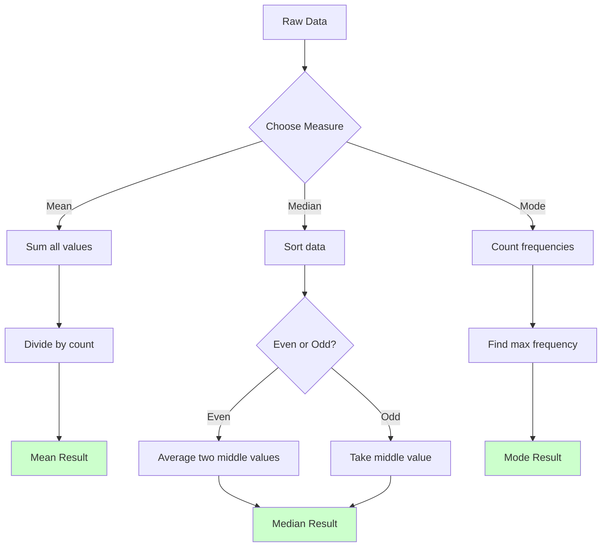

# Coding Guide: Measure of Central Tendency

## Overview
This notebook provides a comprehensive exploration of measures of central tendency (Mean, Median, and Mode) using both manual calculations and statistical libraries. It demonstrates multiple approaches to calculate these measures and visualize the results.

---

## Library Imports

### Complete Import Block
```python
import numpy as np
import pandas as pd
from scipy import stats
import seaborn as sns
import math
```

**Why Each Library?**

1. **numpy (np)**: 
   - Fast numerical computations
   - Array operations
   - Built-in statistical functions

2. **pandas (pd)**:
   - Data manipulation
   - DataFrame operations
   - (Not heavily used in this notebook but imported for potential use)

3. **scipy.stats**:
   - Advanced statistical functions
   - Mode calculation
   - Statistical tests

4. **seaborn (sns)**:
   - Statistical data visualization
   - Distribution plots
   - Beautiful default styling

5. **math**:
   - Basic mathematical operations
   - `floor()` function for rounding down
   - Used in manual median calculation

---

## Part 1: Understanding Data Types

### Creating Data

```python
raw_data = [20, 30, 40, 30]
friends_salary = np.array(raw_data)
```

**Two Different Data Structures**:

1. **Python List** (`raw_data`):
   ```python
   type(raw_data)  # Output: list
   ```
   - Native Python data structure
   - Flexible but slower for numerical operations
   - Can contain mixed data types

2. **NumPy Array** (`friends_salary`):
   ```python
   type(friends_salary)  # Output: numpy.ndarray
   ```
   - Optimized for numerical operations
   - Faster computations
   - Homogeneous data (all same type)
   - Has built-in statistical methods

**Why Both?**
- Shows that statistical functions work with both types
- NumPy arrays are preferred for numerical work
- Understanding data types is important for debugging

---

## Part 2: Computing Mean (Average)

### Method 1: Manual Calculation

```python
sum(raw_data) / len(raw_data)  # Output: 30.0
```

**Breaking It Down**:
- `sum(raw_data)`: Adds all values → 20 + 30 + 40 + 30 = 120
- `len(raw_data)`: Counts elements → 4
- Division: 120 ÷ 4 = 30.0

**Formula**: Mean = (Sum of all values) / (Number of values)

### Method 2: Using NumPy

```python
friends_salary.mean()  # Output: 30.0
```

**Advantages**:
- Cleaner, more readable code
- Handles edge cases automatically
- Faster for large datasets
- Less prone to errors

### Getting Help

```python
? np.mean
```

**What This Does**:
- Shows documentation for `np.mean()`
- Available in Jupyter/IPython environments
- Displays parameters, return values, and examples
- Alternative: `help(np.mean)`

---

## Part 3: Computing Median (Middle Value)

### Understanding the Process

The median requires finding the middle value(s) of sorted data.

### Step 1: Sort the Data

```python
raw_data1 = sorted(raw_data)
print(raw_data1)  # Output: [20, 30, 30, 40]
```

**Why Sort?**
- Median is the middle value when data is ordered
- Sorting arranges values from smallest to largest

### Step 2: Find the Length

```python
len(raw_data1)  # Output: 4
```

**Why This Matters**:
- Even number of values → average of two middle values
- Odd number of values → exact middle value

### Step 3: Calculate Middle Indices

```python
inx1 = math.floor((len(raw_data1) - 1) / 2)
print(inx1)  # Output: 1

inx2 = math.floor(len(raw_data1) / 2)
print(inx2)  # Output: 2
```

**Understanding `math.floor()`**:
- Rounds down to nearest integer
- `floor(1.5)` → 1
- `floor(2.9)` → 2

**Why Two Indices?**
- For even-length lists, we need two middle values
- `inx1 = (4-1)/2 = 1.5` → floor → 1
- `inx2 = 4/2 = 2.0` → floor → 2
- These point to positions 1 and 2 in the sorted list

### Step 4: Calculate Median

```python
(raw_data1[inx1] + raw_data1[inx2]) / 2  # Output: 30.0
```

**Calculation**:
- `raw_data1[1]` = 30
- `raw_data1[2]` = 30
- Median = (30 + 30) / 2 = 30.0

**Visual Representation**:
```
Sorted data: [20, 30, 30, 40]
Index:        0   1   2   3
                  ↑   ↑
                inx1 inx2
Median = (30 + 30) / 2 = 30
```

---

## Part 4: Computing Mode (Most Frequent Value)

### Using Python's Counter

```python
from collections import Counter
c = Counter(raw_data)
print(c)  # Output: Counter({30: 2, 20: 1, 40: 1})
```

**What is Counter?**
- Counts occurrences of each element
- Returns a dictionary-like object
- Key: value, Value: count

### Viewing Counts

```python
c.values()  # Output: dict_values([1, 2, 1])
```

**What This Shows**:
- 20 appears 1 time
- 30 appears 2 times
- 40 appears 1 time

### Finding the Mode

```python
max(c, key=c.get)  # Output: 30
```

**How It Works**:
- `max()`: Finds maximum value
- `key=c.get`: Uses count as the comparison criterion
- Returns the value with highest count
- Result: 30 (appears 2 times)

---

## Part 5: Practical Example with Larger Dataset

### The Dataset

```python
data = np.array([25, 37, 24, 28, 28, 35, 22, 31, 53, 41, 64, 29, 120, 72])
```

**Dataset Characteristics**:
- 14 values
- Range: 22 to 120
- Contains outlier: 120
- Repeated value: 28 (appears twice)

### Using Statistical Libraries

#### Mean
```python
data.mean()  # Output: 43.5
```

**Interpretation**:
- Average value is 43.5
- Pulled up by the outlier (120)
- May not represent "typical" value well

#### Median Using Percentile

```python
np.percentile(data, 50.0)  # Output: 33.0
```

**What is Percentile?**
- `np.percentile(data, p)`: Value below which p% of data falls
- 50th percentile = Median
- 25th percentile = Q1 (first quartile)
- 75th percentile = Q3 (third quartile)

**Getting Help**:
```python
? np.percentile
```

#### Mode Using SciPy

```python
stats.mode(data)[0]  # Output: 28
```

**Understanding the Output**:
- `stats.mode(data)` returns a ModeResult object
- `[0]` extracts just the mode value
- 28 is the most frequent value (appears twice)

**Getting Help**:
```python
? stats.mode
```

---

## Part 6: Visualization

### Basic Distribution Plot

```python
import seaborn as sns
from matplotlib import pyplot as plt

plt.figure(figsize=(15, 8))
ax = sns.distplot(data, kde=True)
```

**Components Explained**:

1. **Figure Size**:
   ```python
   plt.figure(figsize=(15, 8))
   ```
   - Width: 15 inches
   - Height: 8 inches
   - Creates a large, readable plot

2. **Distribution Plot**:
   ```python
   sns.distplot(data, kde=True)
   ```
   - `data`: The dataset to visualize
   - `kde=True`: Adds Kernel Density Estimation curve
   - Shows both histogram and smooth distribution

**Getting Help**:
```python
? sns.distplot
```

### Adding Mean Line

```python
plt.figure(figsize=(15, 8))
ax = sns.distplot(data, kde=True)
plt.axvline(x=data.mean(), linewidth=3, color='g', label="mean", alpha=0.5)
plt.show()
```

**New Element - Vertical Line**:
```python
plt.axvline(x=data.mean(), linewidth=3, color='g', label="mean", alpha=0.5)
```

**Parameters**:
- `x=data.mean()`: Position at mean value (43.5)
- `linewidth=3`: Thickness of line
- `color='g'`: Green color
- `label="mean"`: Label for legend
- `alpha=0.5`: 50% transparency

**Why Add This Line?**
- Visually shows where mean falls
- Easy comparison with distribution shape
- Helps identify if mean is representative

---

## Comparison: Manual vs Library Methods

### Mean Calculation

| Method | Code | Pros | Cons |
|--------|------|------|------|
| Manual | `sum(data)/len(data)` | Educational, transparent | Verbose, error-prone |
| NumPy | `data.mean()` | Clean, fast | Less transparent |
| NumPy Function | `np.mean(data)` | Works with lists too | Slightly longer |

### Median Calculation

| Method | Code | Pros | Cons |
|--------|------|------|------|
| Manual | Sort + index calculation | Understand the process | Complex, error-prone |
| NumPy | `np.median(data)` | Simple, reliable | Black box |
| Percentile | `np.percentile(data, 50)` | Flexible (any percentile) | Less intuitive |

### Mode Calculation

| Method | Code | Pros | Cons |
|--------|------|------|------|
| Counter | `max(Counter(data), key=Counter(data).get)` | Pure Python | Verbose |
| SciPy | `stats.mode(data)[0]` | Clean, statistical | Requires SciPy |

---

## Key Concepts Explained

### 1. Why Sort for Median?

**Example with Unsorted Data**:
```
Unsorted: [40, 20, 30, 30]
Middle values: 20 and 30 → Median = 25 ❌ WRONG!

Sorted: [20, 30, 30, 40]
Middle values: 30 and 30 → Median = 30 ✅ CORRECT!
```

### 2. Even vs Odd Length

**Odd Length** (5 values):
```
[10, 20, 30, 40, 50]
      ↑
   Middle = 30
```

**Even Length** (4 values):
```
[10, 20, 30, 40]
      ↑   ↑
Average = (20 + 30) / 2 = 25
```

### 3. Understanding Outliers

**Dataset**: [25, 37, 24, 28, 28, 35, 22, 31, 53, 41, 64, 29, 120, 72]

**Impact on Mean**:
- Without 120: Mean ≈ 37.5
- With 120: Mean = 43.5
- Difference: 6 units!

**Impact on Median**:
- Without 120: Median ≈ 31.5
- With 120: Median = 33.0
- Difference: 1.5 units (much less affected)

---

## Mermaid Diagram: Calculation Flow



---

## Common Mistakes and How to Avoid Them

### 1. Forgetting to Sort for Median

❌ **Wrong**:
```python
data = [40, 20, 30, 30]
middle = data[len(data)//2]  # Gets 30, but wrong approach!
```

✅ **Correct**:
```python
data = [40, 20, 30, 30]
sorted_data = sorted(data)
# Then calculate median properly
```

### 2. Integer Division Issues

❌ **Wrong** (Python 2 style):
```python
mean = sum(data) / len(data)  # Could give integer in Python 2
```

✅ **Correct**:
```python
mean = sum(data) / len(data)  # Python 3 always gives float
# Or explicitly: float(sum(data)) / len(data)
```

### 3. Mode with No Repeats

```python
data = [1, 2, 3, 4, 5]  # All unique
stats.mode(data)  # Returns first value, but not meaningful!
```

**Solution**: Check if mode is meaningful:
```python
from collections import Counter
c = Counter(data)
if max(c.values()) == 1:
    print("No mode - all values unique")
```

### 4. Confusing Percentile Parameters

❌ **Wrong**:
```python
np.percentile(data, 0.5)  # This is 0.5th percentile, not median!
```

✅ **Correct**:
```python
np.percentile(data, 50)  # 50th percentile = median
```

---

## Practice Exercises

### Exercise 1: Basic Calculations
Calculate mean, median, and mode for:
```python
scores = [85, 90, 78, 92, 88, 76, 95, 88, 82, 88]
```

**Expected Results**:
- Mean: 86.2
- Median: 88.0
- Mode: 88

### Exercise 2: Outlier Impact
Compare mean and median for:
```python
salaries = [30000, 35000, 32000, 38000, 31000, 500000]
```

**Questions**:
1. Which measure is more representative?
2. Why is there such a big difference?

### Exercise 3: Manual Implementation
Write a function to calculate median without using libraries:
```python
def calculate_median(data):
    # Your code here
    pass
```

### Exercise 4: Visualization
Create a plot showing mean, median, and mode as vertical lines:
```python
# Hint: Use plt.axvline() three times with different colors
```

---

## Advanced Tips

### 1. Weighted Mean

When values have different importance:
```python
values = [80, 90, 85]
weights = [0.3, 0.5, 0.2]  # Weights sum to 1.0
weighted_mean = np.average(values, weights=weights)
```

### 2. Handling Missing Data

```python
data_with_nan = [1, 2, np.nan, 4, 5]
np.nanmean(data_with_nan)  # Ignores NaN values
np.nanmedian(data_with_nan)
```

### 3. Multiple Modes

```python
from scipy import stats
data = [1, 1, 2, 2, 3]  # Bimodal
mode_result = stats.mode(data)
# Returns first mode found, but both 1 and 2 are modes
```

### 4. Grouped Data

For data in frequency tables:
```python
values = [1, 2, 3, 4, 5]
frequencies = [2, 3, 5, 3, 2]
# Expand data
expanded = np.repeat(values, frequencies)
mean = expanded.mean()
```

---

## Summary

### Key Takeaways

1. **Mean**: 
   - Best for symmetric distributions
   - Sensitive to outliers
   - Uses all data points

2. **Median**:
   - Best for skewed distributions
   - Robust to outliers
   - Requires sorting

3. **Mode**:
   - Best for categorical data
   - Shows most common value
   - May not exist or be unique

### When to Use Each

```
Normal Distribution → Use Mean
Skewed Distribution → Use Median
Categorical Data → Use Mode
With Outliers → Use Median
Need all data → Use Mean
```

### Library Functions Quick Reference

```python
# Mean
np.mean(data)
data.mean()

# Median
np.median(data)
np.percentile(data, 50)

# Mode
from scipy import stats
stats.mode(data)[0]

# Visualization
sns.distplot(data, kde=True)
plt.axvline(x=value, color='r')
```

---

## Next Steps

1. **Practice**: Try with different datasets
2. **Explore**: Learn about trimmed mean, geometric mean
3. **Visualize**: Create more complex plots
4. **Apply**: Use in real-world data analysis
5. **Advance**: Study measures of variability (next topic)

---

## Additional Resources

- NumPy Documentation: https://numpy.org/doc/
- SciPy Stats: https://docs.scipy.org/doc/scipy/reference/stats.html
- Seaborn Gallery: https://seaborn.pydata.org/examples/
- Khan Academy Statistics: Free video tutorials

