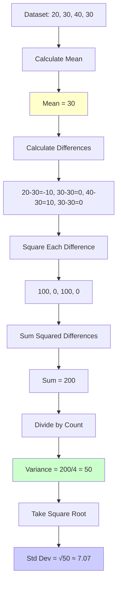

# Coding Guide: Measure of Variability

## Overview
This notebook explores measures of variability (also called measures of dispersion or spread). While central tendency tells us about the "center" of data, variability tells us how spread out the data is. We'll learn about Range, Variance, and Standard Deviation.

---

## Why Variability Matters

### Example: Two Classes with Same Mean

**Class A**: [50, 50, 50, 50, 50] → Mean = 50
**Class B**: [10, 30, 50, 70, 90] → Mean = 50

Both have the same mean, but:
- Class A: All students scored exactly the same (no variability)
- Class B: Scores are very spread out (high variability)

**Variability measures help us understand this difference!**

---

## Library Imports

```python
import numpy as np
import pandas as pd
from scipy import stats
import seaborn as sns
import math
```

**Libraries Used**:
- **numpy**: Statistical calculations, array operations
- **pandas**: Data manipulation (imported but not heavily used here)
- **scipy.stats**: Advanced statistical functions
- **seaborn**: Visualization
- **math**: Mathematical functions like `sqrt()`

---

## Dataset Setup

```python
raw_data = [20, 30, 40, 30]
friends_salary = np.array(raw_data)
```

**Two Formats**:
1. `raw_data`: Python list
2. `friends_salary`: NumPy array

**Data Type Verification**:
```python
type(raw_data)         # Output: list
type(friends_salary)   # Output: numpy.ndarray
```

---

## Measure 1: Range

### What is Range?

**Definition**: The difference between the maximum and minimum values in a dataset.

**Formula**: Range = Maximum - Minimum

### Viewing the Data

```python
friends_salary  # Output: array([20, 30, 40, 30])
```

### Finding Minimum

```python
min(friends_salary)  # Output: 20
```

**What it does**:
- Finds the smallest value in the dataset
- Works with both lists and arrays

### Finding Maximum

```python
? np.max  # Get help on np.max function
```

**Getting Help**:
- `?` before function name shows documentation
- Available in Jupyter/IPython
- Alternative: `help(np.max)`

### Calculating Range - Method 1

```python
max(friends_salary) - min(friends_salary)  # Output: 20
```

**Step by Step**:
1. `max(friends_salary)` = 40
2. `min(friends_salary)` = 20
3. Range = 40 - 20 = 20

### Calculating Range - Method 2 (NumPy)

```python
? np.ptp  # Peak to Peak - another name for range
```

```python
np.ptp(friends_salary)  # Output: 20
```

**What is `ptp`?**
- Stands for "Peak to Peak"
- Another term for range
- More concise than `max() - min()`

### Range: Pros and Cons

**Advantages** ✅:
- Very easy to understand
- Quick to calculate
- Gives immediate sense of spread

**Disadvantages** ❌:
- Only uses two values (ignores everything in between)
- Extremely sensitive to outliers
- Doesn't tell us about distribution shape

**Example of Outlier Impact**:
```python
data1 = [20, 30, 40, 30]      # Range = 20
data2 = [20, 30, 40, 30, 200] # Range = 180 (huge change!)
```

---

## Measure 2: Variance

### What is Variance?

**Definition**: The average of squared differences from the mean.

**Why Squared?**
- Differences can be positive or negative
- Squaring makes all differences positive
- Emphasizes larger deviations

### Step 1: View the Data

```python
friends_salary  # array([20, 30, 40, 30])
```

### Step 2: Calculate Mean

```python
sum(raw_data) / len(raw_data)  # Output: 30.0
```

**Calculation**:
- Sum: 20 + 30 + 40 + 30 = 120
- Count: 4
- Mean: 120 ÷ 4 = 30

### Step 3: Store Mean

```python
mean_salary = sum(raw_data) / len(raw_data)
```

**Why Store It?**
- We'll use it multiple times
- Avoids recalculating
- Makes code more readable

### Step 4: Calculate Sum of Squared Differences

```python
sum_of_squared = 0
for i in range(0, len(friends_salary)):
    sum_of_squared += (friends_salary[i] - mean_salary) ** 2
print(sum_of_squared)  # Output: 200.0
```

**Breaking Down the Loop**:

**Iteration 1** (i=0):
- Value: 20
- Difference: 20 - 30 = -10
- Squared: (-10)² = 100
- sum_of_squared = 0 + 100 = 100

**Iteration 2** (i=1):
- Value: 30
- Difference: 30 - 30 = 0
- Squared: 0² = 0
- sum_of_squared = 100 + 0 = 100

**Iteration 3** (i=2):
- Value: 40
- Difference: 40 - 30 = 10
- Squared: 10² = 100
- sum_of_squared = 100 + 100 = 200

**Iteration 4** (i=3):
- Value: 30
- Difference: 30 - 30 = 0
- Squared: 0² = 0
- sum_of_squared = 200 + 0 = 200

**Visual Representation**:
```
Value:     20    30    40    30
Mean:      30    30    30    30
Diff:     -10     0   +10     0
Squared:  100     0   100     0
                              ----
Sum of Squared Differences = 200
```

### Step 5: Calculate Variance

```python
variance = sum_of_squared / len(friends_salary)
print(variance)  # Output: 50.0
```

**Formula**: Variance = (Sum of Squared Differences) / (Number of Values)

**Calculation**: 200 ÷ 4 = 50

### Using NumPy (Shortcut)

```python
friends_salary.var()  # Output: 50.0
```

**Advantages**:
- One line of code
- Faster for large datasets
- Less error-prone
- Same result as manual calculation

### Understanding Variance

**What does variance = 50 mean?**
- Average squared deviation from mean is 50
- Higher variance = more spread out data
- Lower variance = data closer to mean
- Unit: squared units (salary²)

---

## Measure 3: Standard Deviation

### What is Standard Deviation?

**Definition**: The square root of variance.

**Why Take Square Root?**
- Variance is in squared units (hard to interpret)
- Standard deviation is in original units
- More intuitive to understand

### Step 1: Recall Variance

```python
variance  # Output: 50.0
```

### Step 2: Get Help on Square Root

```python
? math.sqrt
```

**What it shows**:
- Function signature
- Parameters
- Return value
- Examples

### Step 3: Calculate Standard Deviation

```python
math.sqrt(variance)  # Output: 7.0710678118654755
```

**Calculation**: √50 ≈ 7.07

**Interpretation**:
- On average, salaries deviate from mean by about 7.07 units
- In same units as original data
- Easier to interpret than variance

### Using NumPy (Shortcut)

```python
friends_salary.std()  # Output: 7.0710678118654755
```

**One-Step Calculation**:
- Calculates variance internally
- Takes square root
- Returns standard deviation

---

## Comparing All Three Measures

### Summary Table

| Measure | Formula | Value | Units | Interpretation |
|---------|---------|-------|-------|----------------|
| **Range** | Max - Min | 20 | Original | Spread from lowest to highest |
| **Variance** | Σ(x-μ)²/n | 50 | Squared | Average squared deviation |
| **Std Dev** | √Variance | 7.07 | Original | Typical deviation from mean |

### Visual Comparison

```
Data: [20, 30, 40, 30]
Mean: 30

    20        30        40
    |---------|---------|
    ←  10  →  ←  10  →
    
Range = 20 (full spread)
Std Dev ≈ 7.07 (typical deviation)
```

---

## Manual vs Library Calculations

### Variance Comparison

**Manual Method**:
```python
# Step 1: Calculate mean
mean = sum(data) / len(data)

# Step 2: Calculate squared differences
sum_sq = sum((x - mean)**2 for x in data)

# Step 3: Divide by count
variance = sum_sq / len(data)
```

**Library Method**:
```python
variance = data.var()
```

**Pros of Manual**:
- Understand the process
- Educational value
- Can customize

**Pros of Library**:
- Faster to write
- Less error-prone
- Optimized performance

---

## Population vs Sample Variance

### Important Distinction

**Population Variance** (what we calculated):
```python
friends_salary.var()  # Divides by n
```

**Sample Variance** (estimates population):
```python
friends_salary.var(ddof=1)  # Divides by (n-1)
```

**What is `ddof`?**
- "Delta Degrees of Freedom"
- `ddof=0`: Population variance (default)
- `ddof=1`: Sample variance (unbiased estimator)

**When to Use Each**:
- **Population**: You have ALL the data
- **Sample**: You have a subset and want to estimate population

**Example**:
```python
data = [20, 30, 40, 30]

# Population variance
pop_var = np.var(data)        # 50.0

# Sample variance
sample_var = np.var(data, ddof=1)  # 66.67
```

---

## Practical Examples

### Example 1: Comparing Datasets

```python
class_a = [85, 87, 86, 88, 84]  # Consistent scores
class_b = [70, 95, 75, 90, 80]  # Variable scores

print(f"Class A - Mean: {np.mean(class_a)}, Std: {np.std(class_a):.2f}")
print(f"Class B - Mean: {np.mean(class_b)}, Std: {np.std(class_b):.2f}")
```

**Output**:
```
Class A - Mean: 86.0, Std: 1.41
Class B - Mean: 82.0, Std: 9.27
```

**Interpretation**:
- Class A: Lower std dev → more consistent
- Class B: Higher std dev → more variable

### Example 2: Outlier Impact

```python
data_normal = [20, 30, 40, 30]
data_outlier = [20, 30, 40, 30, 200]

print(f"Normal - Range: {np.ptp(data_normal)}, Std: {np.std(data_normal):.2f}")
print(f"Outlier - Range: {np.ptp(data_outlier)}, Std: {np.std(data_outlier):.2f}")
```

**Shows how outliers affect measures differently**

---

## Mermaid Diagram: Variance Calculation Flow



---

## Common Mistakes and Solutions

### Mistake 1: Forgetting to Square

❌ **Wrong**:
```python
sum_diff = sum(abs(x - mean) for x in data)  # Absolute value, not squared
```

✅ **Correct**:
```python
sum_sq = sum((x - mean)**2 for x in data)  # Squared differences
```

### Mistake 2: Wrong Denominator

❌ **Wrong** (for population):
```python
variance = sum_sq / (len(data) - 1)  # This is sample variance
```

✅ **Correct** (for population):
```python
variance = sum_sq / len(data)  # Population variance
```

### Mistake 3: Comparing Variances Across Different Units

❌ **Wrong**:
```python
salary_var = 50  # in dollars²
age_var = 25     # in years²
# Can't directly compare!
```

✅ **Correct** (use coefficient of variation):
```python
cv_salary = std_salary / mean_salary
cv_age = std_age / mean_age
# Now comparable!
```

---

## Practice Exercises

### Exercise 1: Basic Calculations
Calculate range, variance, and standard deviation for:
```python
test_scores = [75, 82, 90, 68, 95, 88, 72]
```

### Exercise 2: Interpretation
Two datasets:
```python
dataset_a = [50, 51, 49, 50, 50]
dataset_b = [30, 50, 70, 40, 60]
```
Both have mean = 50. Which has higher variability? Why?

### Exercise 3: Manual Implementation
Write a function to calculate standard deviation without libraries:
```python
def calculate_std(data):
    # Your code here
    pass
```

### Exercise 4: Real-World Application
You're analyzing daily temperatures:
```python
city_a_temps = [20, 22, 21, 23, 20, 22, 21]  # Stable
city_b_temps = [15, 25, 18, 28, 16, 26, 17]  # Variable
```
Which city has more predictable weather?

---

## Advanced Concepts

### 1. Coefficient of Variation (CV)

**Formula**: CV = (Standard Deviation / Mean) × 100%

**Purpose**: Compare variability across different units

```python
salary_cv = (np.std(salaries) / np.mean(salaries)) * 100
age_cv = (np.std(ages) / np.mean(ages)) * 100
```

### 2. Interquartile Range (IQR)

**Definition**: Range of middle 50% of data

```python
q1 = np.percentile(data, 25)
q3 = np.percentile(data, 75)
iqr = q3 - q1
```

**Advantage**: Less sensitive to outliers than range

### 3. Mean Absolute Deviation (MAD)

**Alternative to standard deviation**:
```python
mad = np.mean(np.abs(data - np.mean(data)))
```

**Advantage**: More robust to outliers

---

## Key Takeaways

### When to Use Each Measure

1. **Range**:
   - Quick overview of spread
   - When outliers are important
   - Simple communication

2. **Variance**:
   - Mathematical calculations
   - Statistical formulas
   - When squared units make sense

3. **Standard Deviation**:
   - Most common measure
   - Same units as data
   - Intuitive interpretation

### Rules of Thumb

**Low Variability**:
- Data points close to mean
- Predictable, consistent
- Small standard deviation

**High Variability**:
- Data points spread out
- Unpredictable, diverse
- Large standard deviation

### The 68-95-99.7 Rule (for Normal Distribution)

- 68% of data within 1 std dev of mean
- 95% of data within 2 std dev of mean
- 99.7% of data within 3 std dev of mean

---

## Summary

### Quick Reference

```python
# Range
range_val = np.ptp(data)
# or
range_val = max(data) - min(data)

# Variance
variance = np.var(data)  # Population
variance = np.var(data, ddof=1)  # Sample

# Standard Deviation
std_dev = np.std(data)  # Population
std_dev = np.std(data, ddof=1)  # Sample
```

### Formulas

| Measure | Formula | Symbol |
|---------|---------|--------|
| Range | Max - Min | R |
| Variance | Σ(x-μ)²/n | σ² |
| Std Dev | √Variance | σ |

---

## Next Steps

1. **Practice**: Calculate measures for different datasets
2. **Visualize**: Create box plots to show variability
3. **Compare**: Analyze datasets with different spreads
4. **Apply**: Use in real-world data analysis
5. **Advance**: Learn about correlation (next topic)

---

## Additional Resources

- Khan Academy: Variance and Standard Deviation
- StatQuest: Standard Deviation Explained
- NumPy Documentation: Statistical Functions
- Practice: Use real datasets from Kaggle

