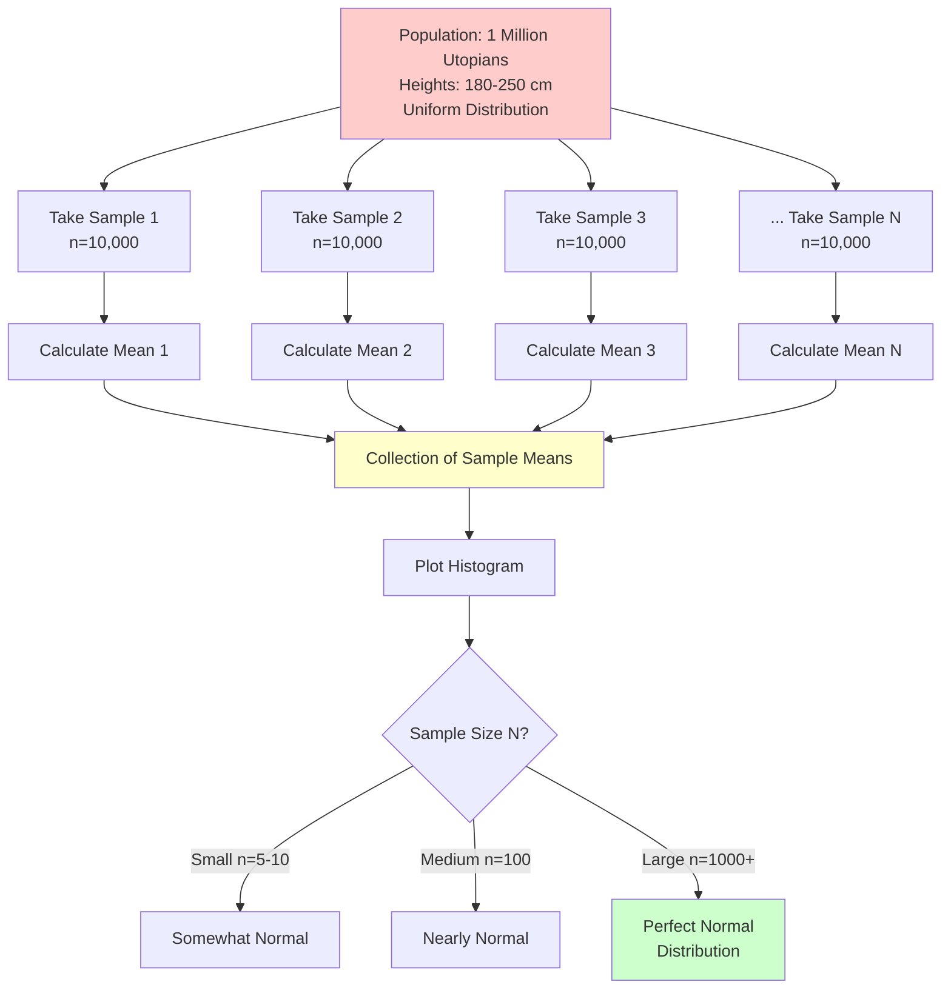

# Coding Guide: Statistics Assignment 1

## Overview
This assignment contains two practical problems that apply statistical concepts:
1. **Stock Returns Analysis**: Calculate and interpret covariance and correlation
2. **Heights Analysis**: Demonstrate the Central Limit Theorem with sampling

---

## Problem 1: Analysis of Stock Returns

### Background

**Real-World Context**:
Investors analyze relationships between stock returns to:
- Diversify portfolios
- Reduce risk
- Identify correlated assets
- Make informed investment decisions

**Key Concepts**:
- **Covariance**: Measures how two variables change together
- **Correlation**: Standardized measure of linear relationship

---

### Problem Statement

You have monthly returns (in %) for two stocks over one year:

```python
Stock A: [2.5, 3.0, -2.0, 4.0, 3.5, -1.5, 2.0, -0.5, 1.5, 2.5, -1.0, 3.0]
Stock B: [1.5, 2.0, -1.0, 3.0, 2.5, -2.0, 1.0, -0.5, 1.0, 2.0, -0.5, 2.5]
```

**Tasks**:
1. Calculate mean returns
2. Compute covariance
3. Compute correlation coefficient
4. Interpret results

---

### Solution Walkthrough

#### Step 1: Import Libraries

```python
import numpy as np
```

**Why NumPy?**
- Efficient array operations
- Built-in statistical functions
- Industry standard for numerical computing

---

#### Step 2: Define the Data

```python
stock_A_returns = np.array([2.5, 3.0, -2.0, 4.0, 3.5, -1.5, 2.0, -0.5, 1.5, 2.5, -1.0, 3.0])
stock_B_returns = np.array([1.5, 2.0, -1.0, 3.0, 2.5, -2.0, 1.0, -0.5, 1.0, 2.0, -0.5, 2.5])
```

**Understanding the Data**:
- 12 months of returns
- Positive values: Profit months
- Negative values: Loss months
- Units: Percentage (%)

**Visual Representation**:
```
Month:  1    2    3    4    5    6    7    8    9   10   11   12
Stock A: 2.5  3.0 -2.0  4.0  3.5 -1.5  2.0 -0.5  1.5  2.5 -1.0  3.0
Stock B: 1.5  2.0 -1.0  3.0  2.5 -2.0  1.0 -0.5  1.0  2.0 -0.5  2.5
```

---

#### Step 3: Calculate Mean Returns

```python
print(f"Stock A mean is: {np.mean(stock_A_returns)}")
print(f"Stock B mean is: {np.mean(stock_B_returns)}")
```

**Expected Output**:
```
Stock A mean is: 1.4166666666666667
Stock B mean is: 1.0
```

**Manual Calculation for Stock A**:
```
Sum = 2.5 + 3.0 + (-2.0) + 4.0 + 3.5 + (-1.5) + 2.0 + (-0.5) + 1.5 + 2.5 + (-1.0) + 3.0
    = 17.0
Mean = 17.0 / 12 = 1.417%
```

**Interpretation**:
- Stock A: Average monthly return of ~1.42%
- Stock B: Average monthly return of 1.0%
- Stock A has slightly higher average returns

---

#### Step 4: Compute Covariance

```python
print(f"Covariance b/w A and B is: {np.cov(stock_A_returns, stock_B_returns)[0][1]}")
```

**Understanding `np.cov()`**:

**What it returns**:
```python
covariance_matrix = np.cov(stock_A_returns, stock_B_returns)
# Returns:
# [[var(A),    cov(A,B)]
#  [cov(B,A), var(B)  ]]
```

**Why `[0][1]`?**
- `[0][1]`: Gets covariance between A and B (top-right)
- `[1][0]`: Same value (bottom-left) - covariance is symmetric
- `[0][0]`: Variance of A
- `[1][1]`: Variance of B

**Expected Output**:
```
Covariance b/w A and B is: 4.068181818181818
```

**What Does This Mean?**
- Positive covariance: Stocks tend to move in same direction
- When Stock A goes up, Stock B tends to go up
- When Stock A goes down, Stock B tends to go down

**Covariance Formula**:
```
Cov(A,B) = Σ[(A_i - mean_A) × (B_i - mean_B)] / (n-1)
```

---

#### Step 5: Compute Correlation Coefficient

```python
print(f"Correlation coefficient is: {np.corrcoef(stock_A_returns, stock_B_returns)[0][1]}")
```

**Understanding `np.corrcoef()`**:

**What it returns**:
```python
correlation_matrix = np.corrcoef(stock_A_returns, stock_B_returns)
# Returns:
# [[1.0,      corr(A,B)]
#  [corr(B,A), 1.0     ]]
```

**Why `[0][1]`?**
- Same indexing as covariance matrix
- Diagonal is always 1.0 (perfect correlation with itself)

**Expected Output**:
```
Correlation coefficient is: 0.9449111825230681
```

**Interpretation**:
- Value: 0.945 (very close to 1.0)
- **Strong positive correlation**
- Stocks move together very closely
- Almost perfect linear relationship

**Correlation Formula**:
```
Corr(A,B) = Cov(A,B) / (σ_A × σ_B)
```
Where σ is standard deviation

---

#### Step 6: Interpret Results

```python
print("Strongly positively correlated")
```

**Detailed Interpretation**:

**Covariance = 4.07**:
- ✅ Positive: Stocks move in same direction
- ⚠️ Hard to interpret magnitude (depends on units)
- Used for calculations, not direct interpretation

**Correlation = 0.945**:
- ✅ Strong positive relationship (close to 1.0)
- ✅ Standardized: Easy to interpret
- ✅ When Stock A returns are high, Stock B returns tend to be high
- ✅ When Stock A returns are low, Stock B returns tend to be low

**Investment Implications**:
```
┌─────────────────────────────────────────┐
│  High Correlation = Poor Diversification │
│                                          │
│  These stocks move together, so:        │
│  - Don't reduce risk much               │
│  - Portfolio not well diversified       │
│  - Consider adding uncorrelated assets  │
└─────────────────────────────────────────┘
```

**Correlation Scale**:
```
-1.0 ←―――――― 0.945 ―――――→ +1.0
Perfect      Strong      Perfect
Negative    Positive    Positive
```

---

### Visualization (Optional Enhancement)

```python
import matplotlib.pyplot as plt

# Scatter plot
plt.figure(figsize=(10, 6))
plt.scatter(stock_A_returns, stock_B_returns, alpha=0.6, s=100)
plt.xlabel('Stock A Returns (%)')
plt.ylabel('Stock B Returns (%)')
plt.title(f'Stock Returns Correlation: {np.corrcoef(stock_A_returns, stock_B_returns)[0][1]:.3f}')
plt.grid(True, alpha=0.3)
plt.axhline(y=0, color='k', linestyle='--', alpha=0.3)
plt.axvline(x=0, color='k', linestyle='--', alpha=0.3)
plt.show()
```

---

### Key Takeaways - Problem 1

1. **Covariance**: Shows direction of relationship (positive/negative)
2. **Correlation**: Shows strength AND direction (-1 to +1)
3. **High correlation**: Stocks move together (poor diversification)
4. **Low correlation**: Stocks move independently (good diversification)

---

## Problem 2: Analysis of Heights (Central Limit Theorem)

### Background

**Scenario**:
- Planet Utopia has 1 million inhabitants
- Heights range: 180 cm to 250 cm
- John wants to estimate population characteristics using sampling

**Goal**: Demonstrate Central Limit Theorem by:
- Taking multiple samples
- Calculating sample means
- Showing distribution of means approaches normal

---

### Problem Statement

**Tasks**:
1. Generate population samples of size 10,000
2. Vary n (number of samples): 5, 10, 100, 1000, 10000
3. Plot histogram of sample means
4. Observe how distribution changes with n

---

### Solution Walkthrough

#### Step 1: Import Libraries

```python
import numpy as np
import matplotlib.pyplot as plt
```

**Why These Libraries?**
- **NumPy**: Random number generation, statistical calculations
- **Matplotlib**: Plotting histograms

---

#### Step 2: Set Up Sampling

```python
sample_count = 100000  # Can be adjusted (5, 10, 100, 1000, 10000)
sample_populations = []
sample_means = []
```

**Variables Explained**:
- `sample_count`: How many times to sample (n)
- `sample_populations`: Store each sample (optional)
- `sample_means`: Store mean of each sample (important!)

---

#### Step 3: Generate Samples and Calculate Means

```python
for i in range(sample_count):
    # Generate one sample of 10,000 heights
    sample_population = np.random.randint(180, 251, 10000)
    
    # Calculate mean of this sample
    sample_mean = np.mean(sample_population)
    
    # Store the mean
    sample_means.append(sample_mean)
```

**Understanding `np.random.randint(180, 251, 10000)`**:
- `180`: Minimum height (inclusive)
- `251`: Maximum height (exclusive, so max is 250)
- `10000`: Number of random heights to generate

**What Happens in Each Iteration**:
```
Iteration 1: Generate 10,000 heights → Calculate mean → Store mean
Iteration 2: Generate 10,000 heights → Calculate mean → Store mean
...
Iteration n: Generate 10,000 heights → Calculate mean → Store mean
```

**Example**:
```
Sample 1: [215, 189, 234, ..., 201] → Mean: 215.3
Sample 2: [198, 245, 187, ..., 223] → Mean: 214.8
Sample 3: [207, 191, 229, ..., 195] → Mean: 215.1
...
```

---

#### Step 4: Plot Histogram

```python
plt.figure(figsize=(12, 6))
plt.hist(sample_means, bins=50, edgecolor='black', alpha=0.7)
plt.xlabel('Sample Mean Height (cm)')
plt.ylabel('Frequency')
plt.title(f'Distribution of Sample Means (n={sample_count})')
plt.axvline(x=np.mean(sample_means), color='r', linestyle='--', 
            linewidth=2, label=f'Mean of Means: {np.mean(sample_means):.2f}')
plt.legend()
plt.grid(True, alpha=0.3)
plt.show()
```

**Plot Components**:
- `bins=50`: Divide data into 50 bins
- `edgecolor='black'`: Black borders on bars
- `alpha=0.7`: 70% opacity
- Red dashed line: Shows mean of all sample means

---

### Expected Results for Different n Values

#### n = 5 (Very Few Samples)
```
Distribution: Somewhat irregular
Shape: Not quite normal yet
Spread: Relatively wide
```

#### n = 10
```
Distribution: Starting to look bell-shaped
Shape: Approaching normal
Spread: Still somewhat wide
```

#### n = 100
```
Distribution: Clearly bell-shaped
Shape: Nearly normal
Spread: Narrower
```

#### n = 1000
```
Distribution: Very smooth bell curve
Shape: Normal distribution
Spread: Narrow
```

#### n = 10000
```
Distribution: Perfect bell curve
Shape: Normal distribution
Spread: Very narrow
Mean: ≈ 215 cm (middle of 180-250)
```

---

### Central Limit Theorem Demonstration

**What We Observe**:

1. **Population Distribution**: Uniform (180-250 cm)
   ```
   |||||||||||||||||||||||||||||
   180              215         250
   ```

2. **Sample Means Distribution**: Normal (bell curve)
   ```
         ●
       ●●●●●
     ●●●●●●●●●
   ●●●●●●●●●●●●●
   210  215  220
   ```

**Key Insights**:
- Original population: Uniform distribution
- Sample means: Normal distribution
- As n increases: Distribution becomes more normal
- Mean of sample means ≈ Population mean (215)

**CLT Formula**:
```
Mean of sample means = Population mean
Standard error = Population std dev / √(sample size)
```

---

### Mermaid Diagram: Sampling Process



---

### Complete Code Solution

```python
import numpy as np
import matplotlib.pyplot as plt

# Function to demonstrate CLT with different sample counts
def demonstrate_clt(sample_count, sample_size=10000):
    """
    Demonstrate Central Limit Theorem
    
    Parameters:
    - sample_count: Number of samples to take (n)
    - sample_size: Size of each sample (default 10,000)
    """
    sample_means = []
    
    # Generate samples and calculate means
    for i in range(sample_count):
        sample = np.random.randint(180, 251, sample_size)
        sample_means.append(np.mean(sample))
    
    # Plot histogram
    plt.figure(figsize=(12, 6))
    plt.hist(sample_means, bins=50, edgecolor='black', alpha=0.7, color='skyblue')
    plt.xlabel('Sample Mean Height (cm)', fontsize=12)
    plt.ylabel('Frequency', fontsize=12)
    plt.title(f'Distribution of Sample Means (n={sample_count}, sample_size={sample_size})', 
              fontsize=14, fontweight='bold')
    
    # Add mean line
    mean_of_means = np.mean(sample_means)
    plt.axvline(x=mean_of_means, color='r', linestyle='--', linewidth=2,
                label=f'Mean: {mean_of_means:.2f} cm')
    
    # Add statistics
    std_of_means = np.std(sample_means)
    plt.text(0.02, 0.98, f'Std Dev: {std_of_means:.2f} cm', 
             transform=plt.gca().transAxes, verticalalignment='top',
             bbox=dict(boxstyle='round', facecolor='wheat', alpha=0.5))
    
    plt.legend(fontsize=10)
    plt.grid(True, alpha=0.3)
    plt.tight_layout()
    plt.show()
    
    # Print statistics
    print(f"\nResults for n={sample_count}:")
    print(f"Mean of sample means: {mean_of_means:.2f} cm")
    print(f"Std dev of sample means: {std_of_means:.2f} cm")
    print(f"Expected population mean: 215 cm")
    print(f"Difference: {abs(mean_of_means - 215):.2f} cm")

# Test with different sample counts
for n in [5, 10, 100, 1000, 10000]:
    demonstrate_clt(n)
```

---

### Key Takeaways - Problem 2

1. **CLT Works**: Sample means form normal distribution
2. **More Samples**: Better approximation to normal
3. **Mean Converges**: Sample means → Population mean
4. **Practical Use**: Can estimate population from samples

---

## Summary

### Problem 1: Stock Returns
- **Covariance**: 4.07 (positive relationship)
- **Correlation**: 0.945 (strong positive)
- **Conclusion**: Stocks highly correlated, poor diversification

### Problem 2: Heights
- **Demonstrates**: Central Limit Theorem
- **Shows**: Sample means → Normal distribution
- **Proves**: Sampling is reliable for estimation

---

## Practice Extensions

### For Problem 1:
1. Add a third stock with negative correlation
2. Calculate portfolio variance
3. Visualize with scatter plots
4. Test different time periods

### For Problem 2:
1. Try different population distributions
2. Vary sample sizes (not just 10,000)
3. Calculate confidence intervals
4. Compare theoretical vs empirical results

---

## Additional Resources

- **NumPy Documentation**: Statistical functions
- **Matplotlib Gallery**: Histogram examples
- **Khan Academy**: Covariance and Correlation
- **StatQuest**: Central Limit Theorem

