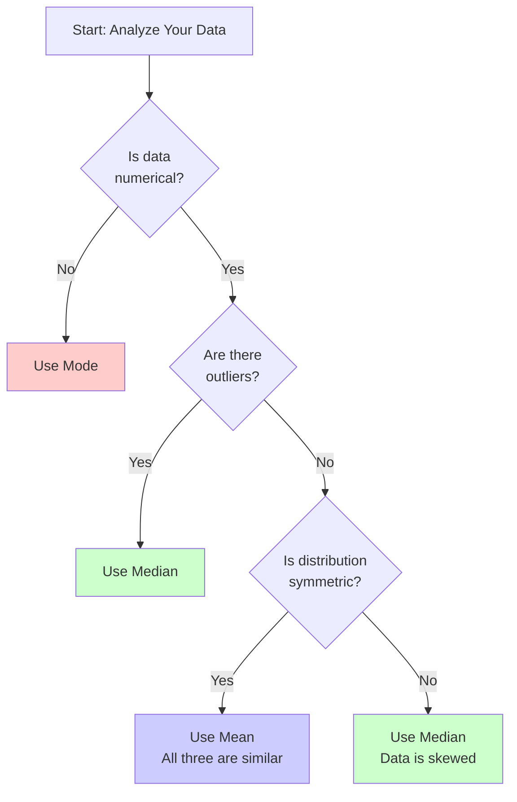

# Coding Guide: Measures of Central Tendency

## Overview
This notebook demonstrates the three main measures of central tendency: Mean, Median, and Mode. These are fundamental statistical concepts used to describe the "center" or "typical value" of a dataset.

---

## Library Imports

### numpy (np)
```python
import numpy as np
```
**Purpose**: Numerical computing library
- Provides functions for calculating mean, median, and other statistical measures
- Works with arrays and numerical data

### pandas (pd)
```python
import pandas as pd
```
**Purpose**: Data manipulation library
- Used for working with structured data
- Provides DataFrame and Series objects

### scipy.stats
```python
from scipy import stats
```
**Purpose**: Scientific computing library with statistical functions
- Provides the `mode()` function for finding the most frequent value
- Contains many other statistical functions

### seaborn (sns)
```python
import seaborn as sns
```
**Purpose**: Statistical data visualization
- Built on top of matplotlib
- Provides `displot()` for distribution plots with KDE

### matplotlib.pyplot (plt)
```python
from matplotlib import pyplot as plt
```
**Purpose**: Data visualization
- Creates plots and charts
- Used for customizing visualizations

### math
```python
import math
```
**Purpose**: Mathematical functions
- Provides basic mathematical operations
- Not heavily used in this notebook but imported for potential use

---

## Example 1: Simple Mean Calculation

### Creating Data

```python
raw_data = [20, 30, 40, 30]
friends_salary = np.array(raw_data)
```

**Explanation**:
- `raw_data`: A Python list containing salary values
- `friends_salary`: Converts the list to a NumPy array
- Both can be used with `np.mean()`

### Calculating Mean

```python
print(np.mean(friends_salary))  # Output: 30.0
print(np.mean(raw_data))        # Output: 30.0
```

**What is Mean?**
- The **average** of all values
- Formula: Sum of all values ÷ Number of values
- Calculation: (20 + 30 + 40 + 30) ÷ 4 = 120 ÷ 4 = 30

**Key Points**:
- `np.mean()` works with both lists and NumPy arrays
- Returns a float value
- Sensitive to outliers (extreme values)

---

## Example 2: Median Calculation

```python
print(np.median(friends_salary))  # Output: 30.0
```

**What is Median?**
- The **middle value** when data is sorted
- For even number of values: average of two middle values
- For odd number of values: the exact middle value

**How it works for our data**:
1. Sort the data: [20, 30, 30, 40]
2. Find middle position: Between index 1 and 2
3. Average the two middle values: (30 + 30) ÷ 2 = 30

**Key Points**:
- Less sensitive to outliers than mean
- Better for skewed distributions
- Always exists for numerical data

---

## Example 3: Comprehensive Statistical Analysis

### Creating a Larger Dataset

```python
data = np.array([25, 37, 24, 28, 28, 35, 22, 31, 53, 41, 64, 29, 120, 72])
```

**Dataset Characteristics**:
- 14 values
- Range: 22 to 120
- Contains an outlier (120)
- Has a repeated value (28 appears twice)

### Mean Calculation

```python
print(np.mean(data))  # Output: 43.5
```

**Calculation**:
- Sum: 25+37+24+28+28+35+22+31+53+41+64+29+120+72 = 609
- Mean: 609 ÷ 14 = 43.5

**Observation**: The mean (43.5) is pulled up by the outlier (120)

### Median Calculation

```python
print(np.median(data))  # Output: 33.0
```

**How it's calculated**:
1. Sort data: [22, 24, 25, 28, 28, 29, 31, 35, 37, 41, 53, 64, 72, 120]
2. Find middle: Between positions 7 and 8 (31 and 35)
3. Average: (31 + 35) ÷ 2 = 33.0

**Observation**: Median (33.0) is less affected by the outlier

### Percentile Calculation

```python
print(np.percentile(data, 50.0))  # Output: 33.0
```

**What is a Percentile?**
- The value below which a given percentage of data falls
- 50th percentile = Median
- `np.percentile(data, 50.0)` gives the same result as `np.median(data)`

**Other Common Percentiles**:
- 25th percentile (Q1): First quartile
- 50th percentile (Q2): Median
- 75th percentile (Q3): Third quartile

### Mode Calculation

```python
print(stats.mode(data))  # Output: ModeResult(mode=np.int64(28), count=np.int64(2))
print(stats.mode(data)[0])  # Output: 28
```

**What is Mode?**
- The **most frequently occurring** value
- In this dataset: 28 appears twice (all others appear once)
- A dataset can have:
  - No mode (all values unique)
  - One mode (unimodal)
  - Multiple modes (bimodal, multimodal)

**Understanding the Output**:
- `stats.mode()` returns a `ModeResult` object
- Contains two pieces of information:
  - `mode`: The most frequent value (28)
  - `count`: How many times it appears (2)
- `stats.mode(data)[0]` extracts just the mode value

---

## Visualization: Distribution Plot

```python
plt.figure(figsize=(15,8))
ax = sns.displot(data, kde=True)
plt.axvline(x=data.mean(), linewidth=3, color='g', label='mean', alpha=0.5)
plt.show()
```

### Breaking Down the Visualization

#### 1. Figure Setup
```python
plt.figure(figsize=(15,8))
```
- Creates a figure with width=15 inches, height=8 inches
- Sets the canvas size for the plot

#### 2. Distribution Plot
```python
ax = sns.displot(data, kde=True)
```
**Components**:
- `sns.displot()`: Creates a distribution plot
- `data`: The dataset to visualize
- `kde=True`: Adds a Kernel Density Estimation curve
  - KDE: A smooth curve showing the probability density
  - Helps visualize the shape of the distribution

**What it shows**:
- Histogram: Bars showing frequency of values in bins
- KDE curve: Smooth line showing the overall distribution shape

#### 3. Mean Line
```python
plt.axvline(x=data.mean(), linewidth=3, color='g', label='mean', alpha=0.5)
```
**Parameters**:
- `x=data.mean()`: Position of the vertical line (at mean value)
- `linewidth=3`: Thickness of the line
- `color='g'`: Green color
- `label='mean'`: Label for the legend
- `alpha=0.5`: Transparency (0=fully transparent, 1=fully opaque)

**Purpose**: Visually shows where the mean falls in the distribution

---

## Comparing Mean, Median, and Mode

### When to Use Each Measure

#### Mean (Average)
**Best for**:
- Normally distributed data
- Data without extreme outliers
- When you need to use all data points

**Advantages**:
- Uses all data points
- Mathematically useful for further calculations

**Disadvantages**:
- Sensitive to outliers
- Can be misleading with skewed data

#### Median (Middle Value)
**Best for**:
- Skewed distributions
- Data with outliers
- Ordinal data (ranked data)

**Advantages**:
- Resistant to outliers
- Better represents "typical" value in skewed data

**Disadvantages**:
- Doesn't use all information in the dataset
- Less useful for mathematical operations

#### Mode (Most Frequent)
**Best for**:
- Categorical data
- Finding the most common value
- Discrete data

**Advantages**:
- Can be used with non-numerical data
- Shows the most typical value

**Disadvantages**:
- May not exist (all values unique)
- May not be unique (multiple modes)
- Doesn't use all data points

---

## Practical Example Analysis

### Our Dataset: [25, 37, 24, 28, 28, 35, 22, 31, 53, 41, 64, 29, 120, 72]

**Mean = 43.5**
- Pulled up by the outlier (120)
- Not representative of most values

**Median = 33.0**
- Better represents the "center" of most values
- Not affected by the outlier

**Mode = 28**
- The only value that appears twice
- Represents the most common value

**Conclusion**: For this dataset, the median (33.0) is probably the best measure of central tendency because:
1. The data is skewed (outlier at 120)
2. Most values cluster below 43.5
3. The median better represents the "typical" value

---

## Key Concepts for Beginners

### 1. Outliers
**Definition**: Values that are significantly different from other observations
- In our example: 120 is an outlier
- Outliers can dramatically affect the mean
- Median is more robust to outliers

### 2. Skewed Distribution
**Definition**: When data is not symmetrically distributed
- **Right-skewed** (positive skew): Tail extends to the right (our example)
- **Left-skewed** (negative skew): Tail extends to the left
- In skewed data: Mean ≠ Median

### 3. Normal Distribution
**Definition**: Symmetric, bell-shaped distribution
- Mean = Median = Mode
- Most data in real life is NOT perfectly normal
- Many statistical tests assume normal distribution

---

## Common Mistakes to Avoid

1. **Using Mean for Skewed Data**
   - ❌ Wrong: Always using mean as the "average"
   - ✅ Right: Check distribution first, use median for skewed data

2. **Ignoring Outliers**
   - ❌ Wrong: Not checking for extreme values
   - ✅ Right: Identify outliers and choose appropriate measure

3. **Misinterpreting Mode**
   - ❌ Wrong: Thinking mode is always meaningful
   - ✅ Right: Mode is most useful for categorical or discrete data

4. **Forgetting Units**
   - ❌ Wrong: Reporting "mean = 43.5"
   - ✅ Right: Reporting "mean salary = $43,500" (with units)

---

## Mermaid Diagram: Choosing the Right Measure



---

## Extension Ideas

1. **Calculate all three measures for different datasets**:
   - Symmetric data
   - Right-skewed data
   - Left-skewed data

2. **Explore weighted mean**:
   - When some values are more important than others

3. **Try with real-world data**:
   - House prices
   - Test scores
   - Income data

4. **Visualize all three measures**:
   - Add vertical lines for mean, median, and mode to the plot

5. **Calculate measures for grouped data**:
   - Data organized in frequency tables

---

## Summary

### Quick Reference

| Measure | Formula | Best For | Pros | Cons |
|---------|---------|----------|------|------|
| **Mean** | Σx/n | Normal distribution | Uses all data | Sensitive to outliers |
| **Median** | Middle value | Skewed data | Robust to outliers | Ignores some information |
| **Mode** | Most frequent | Categorical data | Works with any data type | May not exist or be unique |

### Key Takeaways

1. **Mean**: The arithmetic average, best for symmetric data
2. **Median**: The middle value, best for skewed data
3. **Mode**: The most common value, best for categorical data
4. **Always visualize** your data before choosing a measure
5. **Context matters**: Consider what you're trying to communicate

---

## Practice Questions

1. Calculate mean, median, and mode for: [10, 20, 20, 30, 40, 50, 100]
2. Which measure is most affected by the outlier (100)?
3. If you remove the outlier, how do the measures change?
4. Create a dataset where mean = median = mode
5. Create a dataset where all three measures are different

