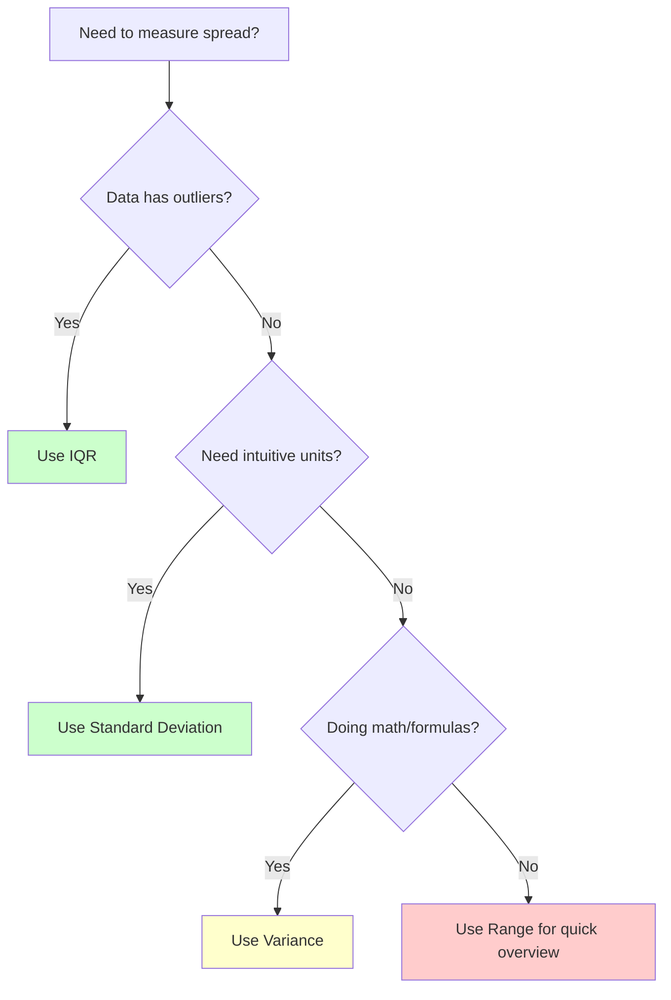

# Coding Guide: Variability (Quick Reference)

## Overview
This is a concise notebook demonstrating the four main measures of variability using library functions. It's a quick reference guide showing how to calculate Range, Variance, Standard Deviation, and IQR (Interquartile Range) in just a few lines of code.

---

## Library Imports

```python
import numpy as np
import pandas as pd
from scipy import stats
import seaborn as sns
import math
```

**Purpose**: Import all necessary libraries for statistical calculations and visualization.

---

## Dataset

```python
raw_data = [20, 30, 40, 30]
friends_salary = np.array(raw_data)
```

**Data**: Simple salary dataset with 4 values
- Minimum: 20
- Maximum: 40
- Mean: 30
- Values: [20, 30, 40, 30]

---

## All Measures in One Block

```python
print(np.ptp(friends_salary))      # Range: 20
print(np.var(friends_salary))      # Variance: 50.0
print(np.std(friends_salary))      # Standard Deviation: 7.07
print(stats.iqr(friends_salary))   # IQR: 5.0
```

---

## Measure 1: Range

```python
np.ptp(friends_salary)  # Output: 20
```

### What it does:
- **ptp** = "Peak to Peak"
- Calculates: Maximum - Minimum
- Result: 40 - 20 = 20

### Interpretation:
- The spread from lowest to highest value is 20 units
- Shows the full extent of the data

### Alternative:
```python
max(friends_salary) - min(friends_salary)  # Same result: 20
```

---

## Measure 2: Variance

```python
np.var(friends_salary)  # Output: 50.0
```

### What it does:
- Calculates average squared deviation from mean
- Formula: Σ(x - μ)² / n

### Step-by-step calculation:
```
Mean = 30
Deviations: [20-30, 30-30, 40-30, 30-30] = [-10, 0, 10, 0]
Squared: [100, 0, 100, 0]
Sum: 200
Variance: 200 / 4 = 50
```

### Interpretation:
- Average squared deviation is 50
- Higher variance = more spread out data
- Units: squared (salary²)

---

## Measure 3: Standard Deviation

```python
np.std(friends_salary)  # Output: 7.0710678118654755
```

### What it does:
- Square root of variance
- Formula: √Variance = √50 ≈ 7.07

### Why use it?
- Same units as original data (not squared)
- More intuitive to interpret
- Most commonly used measure of spread

### Interpretation:
- On average, values deviate from mean by about 7.07 units
- Easier to understand than variance

---

## Measure 4: IQR (Interquartile Range)

```python
stats.iqr(friends_salary)  # Output: 5.0
```

### What it does:
- Measures spread of middle 50% of data
- Formula: Q3 (75th percentile) - Q1 (25th percentile)

### Calculation for our data:
```
Sorted: [20, 30, 30, 40]
Q1 (25th percentile): 27.5
Q3 (75th percentile): 32.5
IQR: 32.5 - 27.5 = 5.0
```

### Why use IQR?
- **Robust to outliers** (unlike range)
- Focuses on middle 50% of data
- Used in box plots
- Better for skewed distributions

### Visual representation:
```
    20        30        30        40
    |---------|---------|---------|
    Min      Q1    Median  Q3     Max
             ←-- IQR --→
```

---

## Comparison Table

| Measure | Function | Value | Units | Outlier Sensitive? |
|---------|----------|-------|-------|--------------------|
| **Range** | `np.ptp()` | 20 | Original | Yes ⚠️ |
| **Variance** | `np.var()` | 50.0 | Squared | Yes ⚠️ |
| **Std Dev** | `np.std()` | 7.07 | Original | Yes ⚠️ |
| **IQR** | `stats.iqr()` | 5.0 | Original | No ✅ |

---

## When to Use Each Measure

### Range
✅ **Use when**:
- Need quick overview
- Outliers are important
- Simple communication

❌ **Avoid when**:
- Data has outliers
- Need robust measure

### Variance
✅ **Use when**:
- Doing mathematical calculations
- Statistical formulas require it
- Theoretical work

❌ **Avoid when**:
- Need intuitive interpretation
- Presenting to non-technical audience

### Standard Deviation
✅ **Use when**:
- Most common scenarios
- Need interpretable measure
- Comparing variability

❌ **Avoid when**:
- Data has extreme outliers
- Distribution is highly skewed

### IQR
✅ **Use when**:
- Data has outliers
- Distribution is skewed
- Creating box plots

❌ **Avoid when**:
- Need to use all data points
- Distribution is normal

---

## Quick Reference Code

### All at once:
```python
data = np.array([20, 30, 40, 30])

# Calculate all measures
range_val = np.ptp(data)
variance = np.var(data)
std_dev = np.std(data)
iqr_val = stats.iqr(data)

# Display results
print(f"Range: {range_val}")
print(f"Variance: {variance}")
print(f"Standard Deviation: {std_dev:.2f}")
print(f"IQR: {iqr_val}")
```

### With interpretation:
```python
data = np.array([20, 30, 40, 30])

print(f"Data spreads from {data.min()} to {data.max()}")
print(f"Range: {np.ptp(data)} units")
print(f"Typical deviation: {np.std(data):.2f} units")
print(f"Middle 50% spread: {stats.iqr(data)} units")
```

---

## Mermaid Diagram: Choosing the Right Measure



---

## Common Patterns

### Pattern 1: Data Summary
```python
def summarize_variability(data):
    """Complete variability summary"""
    return {
        'range': np.ptp(data),
        'variance': np.var(data),
        'std_dev': np.std(data),
        'iqr': stats.iqr(data)
    }

# Usage
summary = summarize_variability(friends_salary)
for measure, value in summary.items():
    print(f"{measure}: {value:.2f}")
```

### Pattern 2: Comparing Datasets
```python
data1 = np.array([20, 30, 40, 30])
data2 = np.array([10, 30, 50, 30])

print(f"Dataset 1 - Std Dev: {np.std(data1):.2f}")
print(f"Dataset 2 - Std Dev: {np.std(data2):.2f}")

if np.std(data2) > np.std(data1):
    print("Dataset 2 is more variable")
```

### Pattern 3: Outlier Detection
```python
def detect_outliers(data):
    """Detect outliers using IQR method"""
    q1 = np.percentile(data, 25)
    q3 = np.percentile(data, 75)
    iqr = stats.iqr(data)
    
    lower_bound = q1 - 1.5 * iqr
    upper_bound = q3 + 1.5 * iqr
    
    outliers = data[(data < lower_bound) | (data > upper_bound)]
    return outliers

# Usage
outliers = detect_outliers(friends_salary)
print(f"Outliers: {outliers}")
```

---

## Practice Exercises

### Exercise 1: Calculate All Measures
```python
test_scores = [65, 70, 75, 80, 85, 90, 95]
# Calculate range, variance, std dev, and IQR
```

### Exercise 2: Compare Variability
```python
class_a = [80, 82, 81, 83, 80]  # Consistent
class_b = [60, 90, 70, 95, 65]  # Variable
# Which class has more consistent scores?
```

### Exercise 3: Outlier Impact
```python
data_normal = [20, 30, 40, 30]
data_outlier = [20, 30, 40, 30, 200]
# Compare how each measure changes
```

---

## Key Takeaways

1. **Four main measures**: Range, Variance, Std Dev, IQR
2. **NumPy functions**: `ptp()`, `var()`, `std()`
3. **SciPy function**: `stats.iqr()`
4. **IQR is robust** to outliers
5. **Std Dev is most common** for normal distributions

---

## Quick Formulas

```
Range = Max - Min

Variance = Σ(x - μ)² / n

Standard Deviation = √Variance

IQR = Q3 - Q1 (75th percentile - 25th percentile)
```

---

## Next Steps

1. ✅ Understand each measure
2. ✅ Know when to use each
3. ✅ Practice with different datasets
4. ➡️ Learn about box plots (visualize IQR)
5. ➡️ Study correlation (next topic)

---

## Related Guides

- **Measure_of_Variability_CODING_GUIDE.md**: Detailed explanations with manual calculations
- **Measure_of_Central_Tendency_CODING_GUIDE.md**: Learn about mean, median, mode
- **Pearson_Correlation_Demo_CODING_GUIDE.md**: Understand relationships between variables

---

## Summary

This notebook provides a **quick reference** for calculating variability measures:

```python
# One-line calculations
range_val = np.ptp(data)           # Spread
variance = np.var(data)            # Squared deviation
std_dev = np.std(data)             # Typical deviation
iqr_val = stats.iqr(data)          # Middle 50% spread
```

**Remember**: 
- Use **IQR** for outlier-resistant measure
- Use **Std Dev** for most common scenarios
- Use **Range** for quick overview
- Use **Variance** for mathematical formulas

