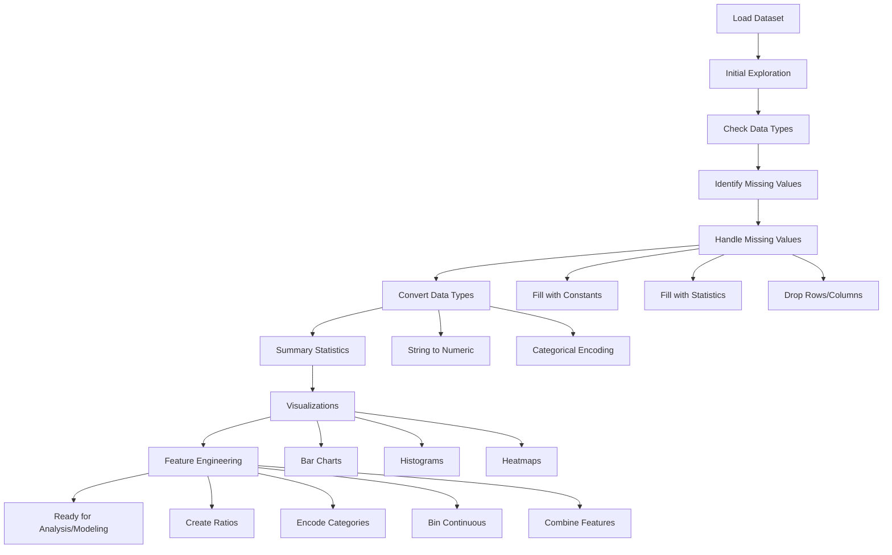

# EDA Assignment Solution - Comprehensive Coding Guide 📊
## LeetCode Dataset Analysis

## Overview
This notebook demonstrates EDA techniques on a LeetCode problems dataset. It covers data loading, exploration, cleaning, visualization, and feature engineering specific to coding problem analysis.

---

## 🎯 Learning Objectives
- Load and explore real-world dataset (LeetCode problems)
- Understand data types and their implications
- Handle missing values strategically
- Analyze categorical and numerical features
- Create visualizations for insights
- Engineer features for better analysis

---

## 📚 Library Imports

```python
import os
import pandas as pd
import numpy as np
import matplotlib.pyplot as plt
import seaborn as sns
```

### Why These Libraries?

**os**: 
- Operating system interface
- Used for file path operations
- Changing directories, checking file existence

**pandas (pd)**:
- Data manipulation and analysis
- DataFrame operations
- CSV file reading/writing

**numpy (np)**:
- Numerical operations
- Array manipulations
- Mathematical functions

**matplotlib.pyplot (plt)**:
- Creating plots and charts
- Customizing visualizations

**seaborn (sns)**:
- Statistical data visualization
- Beautiful default styles
- Complex plots made simple

---

## 📂 Section 1: Loading the Dataset

### Method 1: Google Colab (Cloud Environment)

```python
from google.colab import drive

drive.mount("/content/drive")
os.chdir("/content/gdrive/MyDrive/IK_EDA")
```

**Code Breakdown:**

**`from google.colab import drive`**:
- Imports Google Colab's drive module
- Only works in Google Colab environment
- Not needed for local Jupyter notebooks

**`drive.mount("/content/drive")`**:
- Connects your Google Drive to Colab
- `/content/drive` is the mount point
- You'll need to authorize access

**`os.chdir()`**: Changes current working directory
- `chdir` = "change directory"
- Sets where Python looks for files
- Similar to `cd` command in terminal

### Method 2: Local File Upload (Colab)

```python
from google.colab import files
leetcode_dataset = files.upload()
```

**What It Does:**
- `files.upload()`: Opens file picker dialog
- Uploads file from your computer to Colab
- Returns dictionary with filename as key

### Method 3: Direct CSV Loading

```python
leetcode_df = pd.read_csv("leetcode_dataset.csv")
```

**Code Breakdown:**

**`pd.read_csv()`**: Reads CSV file into DataFrame
- `"leetcode_dataset.csv"`: File path
- Returns pandas DataFrame
- Automatically detects column types

**Common Parameters:**
- `sep=','`: Column separator (default is comma)
- `header=0`: Row number for column names
- `index_col=None`: Which column to use as row labels
- `na_values=['NA', 'null']`: Additional strings to recognize as NaN

---

## 🔍 Section 2: Initial Data Exploration

### 2.1 Viewing First Few Rows

```python
leetcode_df.head()
```

**What It Shows:**
- First 5 rows by default
- All columns
- Helps understand data structure

**LeetCode Dataset Columns:**
- `id`: Problem ID number
- `title`: Problem name
- `description`: Problem statement
- `is_premium`: 0 or 1 (free or premium)
- `difficulty`: Easy, Medium, or Hard
- `solution_link`: URL to solution
- `acceptance_rate`: % of accepted submissions
- `frequency`: How often problem is attempted
- `url`: Link to problem
- `discuss_count`: Number of discussions
- `accepted`: Number of accepted solutions
- `submissions`: Total submissions
- `companies`: Companies that ask this problem
- `related_topics`: Topics/tags (Array, String, etc.)
- `likes`: Upvotes
- `dislikes`: Downvotes
- `rating`: Like ratio
- `asked_by_faang`: 0 or 1 (FAANG companies)
- `similar_questions`: Related problems

---

## ❓ Question 1: What is the Shape of the Dataset?

### Solution:

```python
rows, cols = leetcode_df.shape
print(rows, cols)
```

**Code Breakdown:**

**`.shape`**: Returns tuple (rows, columns)
- Attribute, not a method (no parentheses)
- Returns (1825, 19) for this dataset

**Tuple Unpacking:**
- `rows, cols = leetcode_df.shape`
- Assigns first value to `rows`
- Assigns second value to `cols`

**Alternative Ways:**
```python
# Method 1: Access directly
print(leetcode_df.shape)  # Output: (1825, 19)

# Method 2: Individual access
print(f"Rows: {leetcode_df.shape[0]}")
print(f"Columns: {leetcode_df.shape[1]}")

# Method 3: Using len()
print(f"Rows: {len(leetcode_df)}")
print(f"Columns: {len(leetcode_df.columns)}")
```

### Understanding the Output:
- **1825 rows**: 1825 LeetCode problems
- **19 columns**: 19 features/attributes per problem

---

## 📊 Dataset Information

```python
leetcode_df.info()
```

**What It Shows:**
- Total entries (rows)
- Column names
- Non-null count (identifies missing values)
- Data type of each column
- Memory usage

**Data Types in This Dataset:**
- `int64`: Integer numbers (id, is_premium, likes, dislikes)
- `float64`: Decimal numbers (acceptance_rate, frequency, rating)
- `object`: Text/strings (title, description, difficulty, companies)

**Key Observations:**
- Some columns have fewer non-null values (missing data)
- Mixed data types require different handling
- Memory usage helps understand dataset size

---

## ❓ Question 2: What is the Datatype of Specific Fields?

### Solution:

```python
leetcode_df[["accepted", "acceptance_rate", "submissions"]].dtypes
```

**Code Breakdown:**

**Double Brackets `[[]]`**:
- Selects multiple columns
- Returns a DataFrame (not Series)
- Required for selecting multiple columns

**`.dtypes`**: Returns data types
- Shows dtype for each selected column
- Helps verify data types

**Expected Output:**
```
accepted           object
acceptance_rate    float64
submissions        object
```

**Why "object" for accepted and submissions?**
- They contain strings like "4.1M", "8.7M"
- Not pure numbers
- Need conversion for numerical analysis

**Single vs Double Brackets:**
```python
# Single brackets - returns Series
leetcode_df["accepted"].dtype  # Returns: dtype('O')

# Double brackets - returns DataFrame
leetcode_df[["accepted"]].dtypes  # Returns: Series with column name
```

---

## ❓ Question 3: Number of Missing Values

### Solution:

```python
# Count of missing values
leetcode_df.isnull().sum()
```

**Code Breakdown:**

**`.isnull()`**: Returns Boolean DataFrame
- True where value is missing (NaN, None, NaT)
- False where value exists

**`.sum()`**: Counts True values
- True = 1, False = 0
- Sums up missing values per column

**Example:**
```python
# Original data
# Column A: [1, NaN, 3, NaN, 5]

# After .isnull()
# Column A: [False, True, False, True, False]

# After .sum()
# Column A: 2 (two missing values)
```

### Percentage of Missing Values:

```python
leetcode_df.isnull().sum() / leetcode_df.shape[0]
```

**Code Breakdown:**
- `leetcode_df.shape[0]`: Total number of rows
- Division gives proportion
- Multiply by 100 for percentage

**Better Formatting:**
```python
missing_pct = (leetcode_df.isnull().sum() / len(leetcode_df)) * 100
print(missing_pct.round(2))  # Round to 2 decimal places
```

**Interpretation:**
- 0%: No missing values (complete data)
- <5%: Minor missing data (can drop rows)
- 5-30%: Moderate (imputation recommended)
- >30%: Significant (consider dropping column or advanced imputation)

---

## ❓ Question 4: Cardinality of Columns

### Solution:

```python
leetcode_df.nunique()
```

**Code Breakdown:**

**`.nunique()`**: Counts unique values per column
- "n unique" = number of unique values
- Excludes NaN by default
- Returns Series with counts

**What is Cardinality?**
- Number of distinct/unique values in a column
- Important for understanding data distribution

**Interpretation:**

**Low Cardinality (< 10 unique values):**
- `difficulty`: 3 values (Easy, Medium, Hard)
- `is_premium`: 2 values (0, 1)
- `asked_by_faang`: 2 values (0, 1)
- Good for categorical analysis

**Medium Cardinality (10-100 unique values):**
- Might need grouping or binning

**High Cardinality (> 100 unique values):**
- `id`: 1825 (unique identifier)
- `title`: 1825 (each problem has unique name)
- `companies`: Many combinations
- Difficult to visualize directly

**Why Cardinality Matters:**
- Determines encoding strategy
- Affects visualization choices
- Impacts model performance

---

## 📈 Question 5: Summary Statistics

### Solution:

```python
leetcode_df.describe()
```

**What It Shows:**
- Statistics for numerical columns only
- 8 metrics per column

**Metrics Explained:**

**count**: Non-missing values
- Lower count = more missing data

**mean**: Average value
- Sum of all values ÷ count

**std**: Standard deviation
- Measure of spread/variability
- Higher std = more spread out

**min**: Minimum value

**25% (Q1)**: First quartile
- 25% of data is below this

**50% (Q2)**: Median
- Middle value
- 50% below, 50% above

**75% (Q3)**: Third quartile
- 75% of data is below this

**max**: Maximum value

### Custom Percentiles:

```python
leetcode_df.describe(percentiles=[0.1, 0.3, 0.6])
```

**Code Breakdown:**
- `percentiles=[0.1, 0.3, 0.6]`: Custom percentiles
- 0.1 = 10th percentile
- 0.3 = 30th percentile
- 0.6 = 60th percentile

**Why Custom Percentiles?**
- Better understanding of distribution
- Identify specific thresholds
- Detect skewness

### Categorical Statistics:

```python
leetcode_df.describe(include='object')
```

**Code Breakdown:**
- `include='object'`: Only string/categorical columns
- Different metrics than numerical

**Metrics for Categorical:**
- **count**: Non-missing values
- **unique**: Number of different categories
- **top**: Most frequent value
- **freq**: Frequency of top value

**Example Interpretation:**
```
difficulty:
  count: 1825
  unique: 3
  top: Medium
  freq: 800
```
- 1825 problems have difficulty rating
- 3 difficulty levels
- "Medium" is most common
- 800 problems are Medium difficulty

---

## 🧹 Question 6: Handle Missing Values

### Solution:

```python
# Fill missing solution_link with 'Unknown'
leetcode_df['solution_link'].fillna('Unknown', inplace=True)

# Fill missing similar_questions with 'None'
leetcode_df['similar_questions'].fillna('None', inplace=True)

# Drop rows with missing frequency
leetcode_df = leetcode_df.dropna(subset=['frequency'])
```

**Code Breakdown:**

### `.fillna()` Method:

**Syntax:**
```python
df['column'].fillna(value, inplace=True)
```

**Parameters:**
- `value`: What to fill missing values with
- `inplace=True`: Modify original DataFrame
- `inplace=False`: Return new DataFrame (default)

**Common Fill Strategies:**

**1. Constant Value:**
```python
df['column'].fillna('Unknown', inplace=True)
df['column'].fillna(0, inplace=True)
```

**2. Statistical Measures:**
```python
# Fill with mean
df['age'].fillna(df['age'].mean(), inplace=True)

# Fill with median
df['age'].fillna(df['age'].median(), inplace=True)

# Fill with mode
df['category'].fillna(df['category'].mode()[0], inplace=True)
```

**3. Forward/Backward Fill:**
```python
# Forward fill (use previous value)
df['column'].fillna(method='ffill', inplace=True)

# Backward fill (use next value)
df['column'].fillna(method='bfill', inplace=True)
```

### `.dropna()` Method:

**Syntax:**
```python
df = df.dropna(subset=['column_name'])
```

**Parameters:**
- `subset=['column']`: Only check these columns
- `how='any'`: Drop if ANY value is missing (default)
- `how='all'`: Drop only if ALL values are missing
- `thresh=n`: Keep rows with at least n non-null values

**Examples:**
```python
# Drop rows with any missing value
df_clean = df.dropna()

# Drop rows where specific columns are missing
df_clean = df.dropna(subset=['frequency', 'rating'])

# Drop rows with all missing values
df_clean = df.dropna(how='all')

# Keep rows with at least 15 non-null values
df_clean = df.dropna(thresh=15)
```

**Why Different Strategies?**

**Fill with 'Unknown' (solution_link, similar_questions):**
- Categorical data
- Missing means "not available"
- Preserves all rows
- Allows analysis of "unknown" category

**Drop rows (frequency):**
- Critical numerical feature
- Can't meaningfully impute
- Small number of missing values
- Minimal data loss

---

## 🔄 Question 7: Data Type Conversion

### Problem:
`accepted` and `submissions` are stored as strings ("4.1M", "8.7M") but should be numbers for analysis.

### Solution:

```python
def convert_to_numeric(value):
    """
    Convert string values like '4.1M' or '904.7K' to numeric
    """
    if pd.isna(value):
        return np.nan
    
    value = str(value).strip()
    
    if 'M' in value:
        return float(value.replace('M', '')) * 1_000_000
    elif 'K' in value:
        return float(value.replace('K', '')) * 1_000
    else:
        return float(value)

# Apply conversion
leetcode_df['accepted_numeric'] = leetcode_df['accepted'].apply(convert_to_numeric)
leetcode_df['submissions_numeric'] = leetcode_df['submissions'].apply(convert_to_numeric)
```

**Code Breakdown:**

### Function Definition:

**`def convert_to_numeric(value):`**:
- Defines a function
- Takes one parameter: `value`
- Returns converted number

**`if pd.isna(value):`**:
- Checks if value is missing (NaN)
- `pd.isna()`: pandas function to check for missing values
- Returns `np.nan` if missing

**`value = str(value).strip()`**:
- `str(value)`: Converts to string (in case it's not)
- `.strip()`: Removes leading/trailing whitespace
- Example: " 4.1M " → "4.1M"

**`if 'M' in value:`**:
- Checks if 'M' (million) is in string
- `in`: Membership operator

**`float(value.replace('M', '')) * 1_000_000`**:
- `.replace('M', '')`: Removes 'M' → "4.1M" → "4.1"
- `float()`: Converts to decimal number
- `* 1_000_000`: Multiplies by 1 million
- `1_000_000`: Underscore for readability (same as 1000000)

**`elif 'K' in value:`**:
- Checks for 'K' (thousand)
- Similar logic, multiply by 1,000

**`else:`**:
- If no suffix, just convert to float

### `.apply()` Method:

**Syntax:**
```python
df['new_column'] = df['old_column'].apply(function_name)
```

**What It Does:**
- Applies function to each value in column
- Returns new Series
- Can use lambda functions or defined functions

**Examples:**
```python
# Using defined function
df['doubled'] = df['number'].apply(lambda x: x * 2)

# Using lambda function
df['squared'] = df['number'].apply(lambda x: x ** 2)

# Using built-in function
df['uppercase'] = df['text'].apply(str.upper)
```

**Why Use apply()?**
- Vectorized operation (faster than loops)
- Clean, readable code
- Works with custom functions

---

## 📊 Question 8: Visualizations

### 8.1 Difficulty Distribution

```python
plt.figure(figsize=(10, 6))
difficulty_counts = leetcode_df['difficulty'].value_counts()
plt.bar(difficulty_counts.index, difficulty_counts.values, color=['green', 'orange', 'red'])
plt.xlabel('Difficulty Level')
plt.ylabel('Number of Problems')
plt.title('Distribution of Problems by Difficulty')
plt.show()
```

**Code Breakdown:**

**`plt.figure(figsize=(10, 6))`**:
- Creates new figure
- Width=10 inches, Height=6 inches

**`.value_counts()`**:
- Counts occurrences of each unique value
- Returns Series sorted by frequency (descending)
- Example output:
  ```
  Medium    800
  Easy      600
  Hard      425
  ```

**`plt.bar()`**: Creates bar chart
- `difficulty_counts.index`: X-axis values (Easy, Medium, Hard)
- `difficulty_counts.values`: Y-axis values (counts)
- `color=['green', 'orange', 'red']`: Bar colors

**Color Options:**
```python
# Named colors
color='blue'
color=['red', 'green', 'blue']

# Hex codes
color='#FF5733'

# RGB tuples
color=(0.5, 0.2, 0.8)
```

### 8.2 Acceptance Rate Distribution

```python
plt.figure(figsize=(10, 6))
plt.hist(leetcode_df['acceptance_rate'], bins=30, edgecolor='black', alpha=0.7)
plt.xlabel('Acceptance Rate (%)')
plt.ylabel('Frequency')
plt.title('Distribution of Acceptance Rates')
plt.axvline(leetcode_df['acceptance_rate'].mean(), color='red', linestyle='--', label='Mean')
plt.legend()
plt.show()
```

**New Elements:**

**`plt.axvline()`**: Adds vertical line
- `x`: X-coordinate for line
- `color='red'`: Line color
- `linestyle='--'`: Dashed line
- `label='Mean'`: Legend label

**Line Styles:**
- `'-'`: Solid line (default)
- `'--'`: Dashed line
- `'-.'`: Dash-dot line
- `':'`: Dotted line

**`plt.legend()`**: Shows legend
- Displays labels from plot elements
- Automatic positioning (can customize)

### 8.3 Top Companies

```python
# Extract and count companies
all_companies = []
for companies in leetcode_df['companies'].dropna():
    company_list = companies.split(',')
    all_companies.extend(company_list)

company_counts = pd.Series(all_companies).value_counts().head(10)

plt.figure(figsize=(12, 6))
plt.barh(company_counts.index, company_counts.values)
plt.xlabel('Number of Problems')
plt.ylabel('Company')
plt.title('Top 10 Companies by Number of Problems')
plt.gca().invert_yaxis()  # Highest at top
plt.show()
```

**Code Breakdown:**

**List Comprehension Alternative:**
```python
all_companies = [
    company 
    for companies in leetcode_df['companies'].dropna() 
    for company in companies.split(',')
]
```

**`.split(',')`**: Splits string by comma
- "Amazon,Google,Apple" → ["Amazon", "Google", "Apple"]

**`.extend()`**: Adds multiple items to list
- Different from `.append()` which adds one item

**`pd.Series(all_companies)`**: Creates Series from list
- Allows using pandas methods like `.value_counts()`

**`.head(10)`**: Gets top 10 values

**`plt.barh()`**: Horizontal bar chart
- 'h' = horizontal
- Better for long labels

**`.gca().invert_yaxis()`**:
- `gca()`: "Get Current Axes"
- `.invert_yaxis()`: Flips y-axis
- Shows highest value at top

### 8.4 Correlation Heatmap

```python
# Select numerical columns
numerical_cols = ['acceptance_rate', 'frequency', 'likes', 'dislikes', 'rating']
correlation_matrix = leetcode_df[numerical_cols].corr()

plt.figure(figsize=(10, 8))
sns.heatmap(correlation_matrix, annot=True, cmap='coolwarm', fmt='.2f', 
            square=True, linewidths=1)
plt.title('Correlation Matrix of Numerical Features')
plt.show()
```

**Code Breakdown:**

**`.corr()`**: Calculates correlation matrix
- Pearson correlation coefficient
- Values from -1 to 1

**`sns.heatmap()` Parameters:**
- `annot=True`: Show values in cells
- `cmap='coolwarm'`: Color scheme
- `fmt='.2f'`: Format numbers (2 decimal places)
- `square=True`: Make cells square
- `linewidths=1`: Width of lines between cells

**Color Maps:**
- `'coolwarm'`: Blue (negative) to Red (positive)
- `'viridis'`: Purple to Yellow
- `'RdYlGn'`: Red-Yellow-Green

**Interpreting Correlations:**
- **1.0**: Perfect positive correlation
- **0.7 to 1.0**: Strong positive
- **0.3 to 0.7**: Moderate positive
- **-0.3 to 0.3**: Weak/no correlation
- **-0.7 to -0.3**: Moderate negative
- **-1.0 to -0.7**: Strong negative
- **-1.0**: Perfect negative correlation

---

## 🔧 Question 9: Feature Engineering

### 9.1 Create Success Rate Feature

```python
leetcode_df['success_rate'] = (
    leetcode_df['accepted_numeric'] / leetcode_df['submissions_numeric'] * 100
)
```

**Logic:**
- Success rate = (Accepted / Total Submissions) × 100
- Measures problem difficulty from submission perspective
- Different from acceptance_rate (which is given)

### 9.2 Create Popularity Score

```python
leetcode_df['popularity_score'] = (
    leetcode_df['likes'] - leetcode_df['dislikes']
)
```

**Logic:**
- Net likes = Likes - Dislikes
- Positive = more liked
- Negative = more disliked
- Simple measure of problem quality

### 9.3 Create Difficulty Encoding

```python
difficulty_map = {'Easy': 1, 'Medium': 2, 'Hard': 3}
leetcode_df['difficulty_encoded'] = leetcode_df['difficulty'].map(difficulty_map)
```

**Code Breakdown:**

**`.map()`**: Maps values using dictionary
- Keys: Original values
- Values: New values
- Returns new Series

**Why Encode?**
- Machine learning models need numbers
- Preserves ordinal relationship (Easy < Medium < Hard)
- Alternative to one-hot encoding

**Alternative: Label Encoder**
```python
from sklearn.preprocessing import LabelEncoder

le = LabelEncoder()
leetcode_df['difficulty_encoded'] = le.fit_transform(leetcode_df['difficulty'])
```

### 9.4 Create FAANG Difficulty Feature

```python
leetcode_df['faang_difficulty'] = (
    leetcode_df['asked_by_faang'].astype(str) + '_' + leetcode_df['difficulty']
)
```

**Code Breakdown:**

**`.astype(str)`**: Converts to string
- Necessary for string concatenation
- `0` → `"0"`, `1` → `"1"`

**String Concatenation:**
- `+` operator joins strings
- `'_'` adds underscore separator

**Result:**
- `"0_Easy"`: Not asked by FAANG, Easy
- `"1_Hard"`: Asked by FAANG, Hard

**Why This Feature?**
- Combines two features
- Captures interaction effect
- FAANG problems might have different difficulty perception

### 9.5 Binning Acceptance Rate

```python
bins = [0, 30, 50, 70, 100]
labels = ['Very Hard', 'Hard', 'Medium', 'Easy']
leetcode_df['acceptance_category'] = pd.cut(
    leetcode_df['acceptance_rate'], 
    bins=bins, 
    labels=labels
)
```

**Code Breakdown:**

**`pd.cut()`**: Bins continuous data
- Divides range into intervals
- Assigns labels to intervals

**Parameters:**
- `bins=[0, 30, 50, 70, 100]`: Boundary values
  - 0-30: Very Hard
  - 30-50: Hard
  - 50-70: Medium
  - 70-100: Easy
- `labels=[]`: Names for each bin

**Why Binning?**
- Simplifies continuous data
- Easier to interpret
- Can improve model performance
- Better for visualization

---

## 🎯 Key Takeaways

### Data Loading
1. Multiple methods: local, cloud, upload
2. Always verify data loaded correctly with `.head()`
3. Check file path and format

### Data Exploration
1. Use `.shape` for dimensions
2. Use `.info()` for structure
3. Use `.describe()` for statistics
4. Check missing values with `.isnull().sum()`

### Data Cleaning
1. Identify missing value patterns
2. Choose appropriate strategy (fill vs drop)
3. Convert data types when needed
4. Verify cleaning with checks

### Visualization
1. Bar charts for categorical distributions
2. Histograms for numerical distributions
3. Heatmaps for correlations
4. Choose appropriate chart type for data

### Feature Engineering
1. Create derived features (ratios, differences)
2. Encode categorical variables
3. Bin continuous variables
4. Combine features for interactions

---

## 🔄 Complete Workflow Diagram



---

## 💡 Common Pitfalls to Avoid

1. **Not checking data types**: Always use `.info()` first
2. **Ignoring missing values**: Check before analysis
3. **Wrong fill strategy**: Consider data context
4. **Forgetting inplace=True**: Changes won't save
5. **Not converting string numbers**: "4.1M" needs conversion
6. **Overcomplicating visualizations**: Keep it simple
7. **Creating too many features**: Focus on meaningful ones

---

## 🎓 Practice Exercises

1. Create a feature for "problem_age" (days since problem was added)
2. Analyze which topics are most common for each difficulty
3. Find correlation between discuss_count and likes
4. Create bins for frequency (Low, Medium, High)
5. Visualize acceptance rate by difficulty level
6. Identify problems with high likes but low acceptance rate

---

## 📖 Additional Resources

- Pandas Documentation: https://pandas.pydata.org/docs/
- Matplotlib Gallery: https://matplotlib.org/stable/gallery/
- Seaborn Tutorial: https://seaborn.pydata.org/tutorial.html
- Feature Engineering Guide: https://www.kaggle.com/learn/feature-engineering
