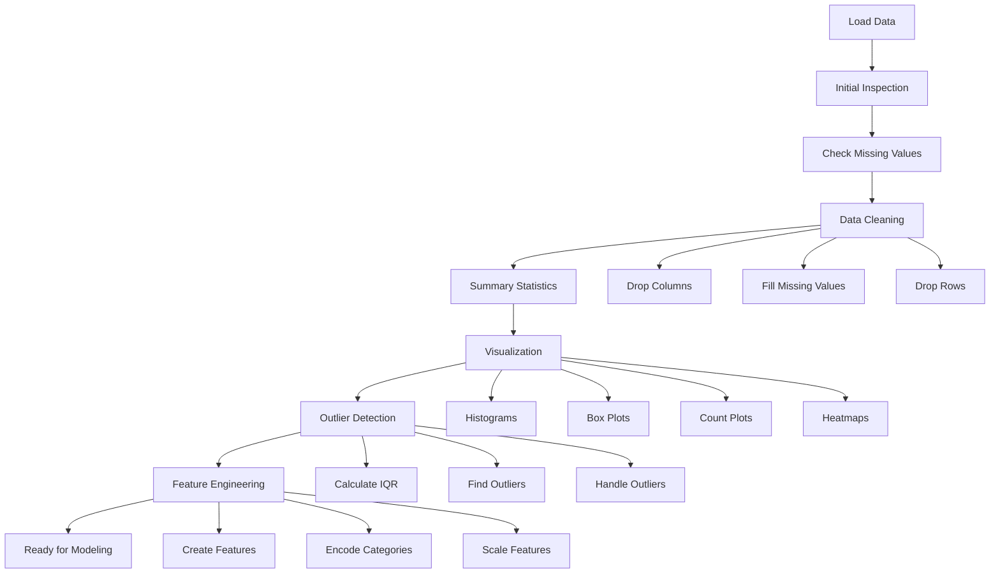

# EDA.ipynb - Comprehensive Coding Guide 📊

## Overview
This notebook demonstrates Exploratory Data Analysis (EDA) and Feature Engineering using the Titanic dataset. It covers data loading, cleaning, visualization, outlier detection, and feature engineering techniques.

---

## 🎯 Learning Objectives
- Understand how to load and inspect datasets
- Learn data cleaning techniques for missing values
- Master visualization techniques for data exploration
- Identify and handle outliers
- Apply feature engineering methods

---

## 📚 Library Imports

```python
import numpy as np
import pandas as pd
import matplotlib.pyplot as plt
import seaborn as sns
```

### Why These Libraries?

**numpy (np)**: 
- Provides numerical computing capabilities
- Used for mathematical operations on arrays
- Essential for statistical calculations

**pandas (pd)**:
- Primary library for data manipulation and analysis
- Provides DataFrame structure (like Excel tables in Python)
- Offers powerful data cleaning and transformation methods

**matplotlib.pyplot (plt)**:
- Core plotting library for creating visualizations
- Provides low-level control over plot elements
- Used for customizing charts and graphs

**seaborn (sns)**:
- Built on top of matplotlib for statistical visualizations
- Provides beautiful default styles and color palettes
- Includes built-in datasets (like Titanic) for practice
- Simplifies complex visualizations

---

## 🔄 Section 1: Loading the Dataset

### Code:
```python
titanic = sns.load_dataset('titanic')
```

### What It Does:
- `sns.load_dataset('titanic')`: Loads the Titanic dataset from seaborn's built-in datasets
- Returns a pandas DataFrame containing passenger information
- The dataset is stored in the variable `titanic`

### Key Concept:
Seaborn provides several built-in datasets for practice. The Titanic dataset contains information about passengers including survival status, age, class, fare, etc.

---

## 👀 Section 2: Initial Data Inspection

### 2.1 Viewing First Few Rows

```python
titanic.head()
```

**What It Does:**
- `.head()`: Shows the first 5 rows of the DataFrame by default
- You can specify a number: `.head(10)` shows first 10 rows
- Helps understand the structure and sample data

**Key Columns in Titanic Dataset:**
- `survived`: 0 = Did not survive, 1 = Survived
- `pclass`: Passenger class (1 = First, 2 = Second, 3 = Third)
- `sex`: Gender of passenger
- `age`: Age in years
- `sibsp`: Number of siblings/spouses aboard
- `parch`: Number of parents/children aboard
- `fare`: Ticket price
- `embarked`: Port of embarkation (C = Cherbourg, Q = Queenstown, S = Southampton)
- `deck`: Deck location on ship
- `alone`: Boolean indicating if passenger was traveling alone

### 2.2 Dataset Structure Information

```python
titanic.info()
```

**What It Does:**
- Shows the number of rows and columns
- Lists all column names with their data types
- Displays non-null count (helps identify missing values)
- Shows memory usage

**Data Types You'll See:**
- `int64`: Integer numbers (whole numbers)
- `float64`: Decimal numbers
- `object`: Text/string data
- `bool`: True/False values
- `category`: Categorical data (limited set of values)

**Why This Matters:**
- Identifies which columns have missing data
- Helps plan data cleaning strategy
- Shows if data types need conversion

### 2.3 Checking Missing Values

```python
titanic.isnull().sum()
```

**Breaking It Down:**
- `.isnull()`: Returns True for missing values, False otherwise
- `.sum()`: Counts the True values (missing values) for each column
- Result shows how many missing values each column has

**Common Missing Value Patterns:**
- `age`: 177 missing - needs imputation
- `deck`: 688 missing - might need to drop this column
- `embarked`: 2 missing - can fill with mode

---

## 📊 Section 3: Summary Statistics

### 3.1 Numerical Features Statistics

```python
titanic.describe()
```

**What It Does:**
- Calculates statistics for numerical columns only
- Provides 8 key metrics for each column

**Metrics Explained:**
- **count**: Number of non-missing values
- **mean**: Average value (sum ÷ count)
- **std**: Standard deviation (measure of spread)
- **min**: Smallest value
- **25%**: First quartile (25% of data is below this)
- **50%**: Median (middle value)
- **75%**: Third quartile (75% of data is below this)
- **max**: Largest value

**Example Interpretation (Age column):**
- count: 714 (177 missing)
- mean: 29.7 years (average age)
- std: 14.5 (ages vary widely)
- min: 0.42 (youngest passenger)
- 25%: 20.1 (25% are younger than 20)
- 50%: 28.0 (median age)
- 75%: 38.0 (75% are younger than 38)
- max: 80.0 (oldest passenger)

### 3.2 Categorical Features Statistics

```python
titanic.describe(include=['category'])
```

**What It Does:**
- Shows statistics for categorical columns
- Different metrics than numerical data

**Metrics for Categorical Data:**
- **count**: Number of non-missing values
- **unique**: Number of different categories
- **top**: Most frequent category
- **freq**: How many times the top category appears

**Example (class column):**
- count: 891 passengers
- unique: 3 classes (First, Second, Third)
- top: Third (most common)
- freq: 491 (491 passengers in Third class)

---

## 🧹 Section 4: Data Cleaning

### 4.1 Strategy for Missing Values

**Decision Framework:**

1. **High Missing % (>70%)**: Drop the column
   - Example: `deck` has 688/891 missing (77%)
   - Not enough data to be useful

2. **Numerical Data**: Fill with median
   - Example: `age` - use median because it's not affected by outliers
   - Median is better than mean when data has extreme values

3. **Categorical Data**: Fill with mode
   - Example: `embarked` - use most common port
   - Mode = most frequent value

4. **Few Missing Values**: Drop rows
   - When only a few rows have missing data
   - Minimal data loss

### 4.2 Handling Missing Values Code

```python
# Drop columns with too many missing values
titanic = titanic.drop(columns=['deck'])
```

**Explanation:**
- `.drop(columns=['deck'])`: Removes the deck column
- `columns=` specifies we're dropping columns (not rows)
- Can drop multiple: `columns=['deck', 'cabin']`

```python
# Fill numerical missing values with median
titanic['age'].fillna(titanic['age'].median(), inplace=True)
```

**Breaking It Down:**
- `titanic['age']`: Selects the age column
- `.fillna()`: Fills missing values
- `titanic['age'].median()`: Calculates median of age column
- `inplace=True`: Modifies the original DataFrame (doesn't create a copy)

**Why Median for Age?**
- Not affected by extreme values (outliers)
- Better represents "typical" age than mean
- Example: Ages [20, 25, 30, 35, 100] → median=30, mean=42

```python
# Fill categorical missing values with mode
titanic['embarked'].fillna(titanic['embarked'].mode()[0], inplace=True)
```

**Breaking It Down:**
- `.mode()`: Returns the most frequent value(s)
- `[0]`: Gets the first mode (in case of ties)
- Fills missing embarked values with most common port

```python
# Drop rows with remaining missing values
titanic = titanic.dropna()
```

**What It Does:**
- `.dropna()`: Removes any rows that still have missing values
- Default removes rows with ANY missing value
- Can specify: `dropna(subset=['column_name'])` to check specific columns

### 4.3 Verify Cleaning

```python
titanic.isnull().sum()
```

**Expected Result:**
- All columns should show 0 missing values
- Confirms data cleaning was successful

---

## 📈 Section 5: Data Visualization

### 5.1 Distribution Plots

#### Histogram for Age Distribution

```python
plt.figure(figsize=(10, 6))
plt.hist(titanic['age'], bins=30, edgecolor='black', alpha=0.7)
plt.xlabel('Age')
plt.ylabel('Frequency')
plt.title('Age Distribution of Titanic Passengers')
plt.show()
```

**Code Breakdown:**

**`plt.figure(figsize=(10, 6))`**:
- Creates a new figure for the plot
- `figsize=(width, height)` in inches
- (10, 6) creates a 10-inch wide by 6-inch tall plot

**`plt.hist()`**: Creates a histogram
- `titanic['age']`: Data to plot
- `bins=30`: Divides data into 30 intervals
- `edgecolor='black'`: Black borders around bars
- `alpha=0.7`: Transparency (0=invisible, 1=solid)

**`plt.xlabel('Age')`**: Labels x-axis

**`plt.ylabel('Frequency')`**: Labels y-axis

**`plt.title()`**: Adds title to plot

**`plt.show()`**: Displays the plot

**What to Look For:**
- Shape of distribution (normal, skewed, bimodal)
- Most common age ranges
- Presence of outliers

#### Box Plot for Fare by Class

```python
plt.figure(figsize=(10, 6))
sns.boxplot(x='class', y='fare', data=titanic)
plt.xlabel('Passenger Class')
plt.ylabel('Fare')
plt.title('Fare Distribution by Passenger Class')
plt.show()
```

**Code Breakdown:**

**`sns.boxplot()`**: Creates a box plot
- `x='class'`: Categorical variable on x-axis
- `y='fare'`: Numerical variable on y-axis
- `data=titanic`: DataFrame containing the data

**Box Plot Components:**
- **Box**: Contains middle 50% of data (IQR)
- **Line in box**: Median value
- **Whiskers**: Extend to 1.5 × IQR
- **Dots**: Outliers beyond whiskers

**Interpretation:**
- Compare fare distributions across classes
- First class has higher median fare
- Identify outliers (unusually high/low fares)

### 5.2 Count Plots for Categorical Variables

```python
plt.figure(figsize=(10, 6))
sns.countplot(x='survived', data=titanic)
plt.xlabel('Survived')
plt.ylabel('Count')
plt.title('Survival Count')
plt.show()
```

**What It Does:**
- `sns.countplot()`: Counts occurrences of each category
- Shows how many passengers survived (1) vs didn't survive (0)
- Useful for understanding class imbalance

```python
plt.figure(figsize=(10, 6))
sns.countplot(x='class', hue='survived', data=titanic)
plt.xlabel('Passenger Class')
plt.ylabel('Count')
plt.title('Survival Count by Passenger Class')
plt.legend(title='Survived', labels=['No', 'Yes'])
plt.show()
```

**New Parameter:**
- `hue='survived'`: Splits bars by survival status
- Creates grouped bar chart
- Different colors for survived vs not survived

**Interpretation:**
- Compare survival rates across classes
- Third class had more deaths
- First class had better survival rate

### 5.3 Correlation Heatmap

```python
plt.figure(figsize=(12, 8))
correlation_matrix = titanic.corr()
sns.heatmap(correlation_matrix, annot=True, cmap='coolwarm', fmt='.2f')
plt.title('Correlation Matrix of Titanic Dataset')
plt.show()
```

**Code Breakdown:**

**`titanic.corr()`**:
- Calculates correlation between all numerical columns
- Returns a correlation matrix
- Values range from -1 to 1

**`sns.heatmap()`**: Creates a color-coded matrix
- `correlation_matrix`: Data to visualize
- `annot=True`: Shows correlation values in cells
- `cmap='coolwarm'`: Color scheme (blue=negative, red=positive)
- `fmt='.2f'`: Format numbers to 2 decimal places

**Correlation Values:**
- **1.0**: Perfect positive correlation
- **0.0**: No correlation
- **-1.0**: Perfect negative correlation
- **> 0.7 or < -0.7**: Strong correlation

**What to Look For:**
- Strong positive correlations (features that increase together)
- Strong negative correlations (one increases, other decreases)
- Multicollinearity (highly correlated features)

---

## 🔍 Section 6: Outlier Detection

### 6.1 Using IQR Method

```python
Q1 = titanic['fare'].quantile(0.25)
Q3 = titanic['fare'].quantile(0.75)
IQR = Q3 - Q1

lower_bound = Q1 - 1.5 * IQR
upper_bound = Q3 + 1.5 * IQR

outliers = titanic[(titanic['fare'] < lower_bound) | (titanic['fare'] > upper_bound)]
```

**Code Breakdown:**

**`.quantile(0.25)`**: Calculates 25th percentile (Q1)
- 25% of data is below this value

**`.quantile(0.75)`**: Calculates 75th percentile (Q3)
- 75% of data is below this value

**`IQR = Q3 - Q1`**: Interquartile Range
- Range containing middle 50% of data
- Measure of spread

**Outlier Boundaries:**
- `lower_bound = Q1 - 1.5 * IQR`: Lower fence
- `upper_bound = Q3 + 1.5 * IQR`: Upper fence
- Values outside these bounds are outliers

**Boolean Indexing:**
- `titanic['fare'] < lower_bound`: Finds values below lower bound
- `titanic['fare'] > upper_bound`: Finds values above upper bound
- `|`: OR operator (either condition)
- Result: DataFrame containing only outliers

### 6.2 Visualizing Outliers

```python
plt.figure(figsize=(10, 6))
sns.boxplot(x=titanic['fare'])
plt.title('Box Plot of Fare with Outliers')
plt.show()
```

**What to Look For:**
- Dots beyond whiskers = outliers
- How many outliers exist
- Whether outliers are errors or valid extreme values

### 6.3 Handling Outliers

**Option 1: Remove Outliers**
```python
titanic_no_outliers = titanic[(titanic['fare'] >= lower_bound) & (titanic['fare'] <= upper_bound)]
```

**Breaking It Down:**
- `&`: AND operator (both conditions must be true)
- Keeps only rows within bounds
- Creates new DataFrame without outliers

**Option 2: Cap Outliers**
```python
titanic['fare'] = titanic['fare'].clip(lower=lower_bound, upper=upper_bound)
```

**What It Does:**
- `.clip()`: Limits values to specified range
- Values below lower_bound become lower_bound
- Values above upper_bound become upper_bound
- Preserves data points but reduces extreme values

---

## 🔧 Section 7: Feature Engineering

### 7.1 Creating New Features from Existing Ones

#### Family Size Feature

```python
titanic['family_size'] = titanic['sibsp'] + titanic['parch'] + 1
```

**Logic:**
- `sibsp`: Number of siblings/spouses
- `parch`: Number of parents/children
- `+ 1`: Include the passenger themselves
- Result: Total family members aboard

**Why This Matters:**
- Family size might affect survival
- Larger families might stay together
- Single travelers might have different survival rates

#### Age Group Feature

```python
titanic['age_group'] = pd.cut(titanic['age'], 
                               bins=[0, 12, 18, 35, 60, 100],
                               labels=['Child', 'Teen', 'Adult', 'Middle-aged', 'Senior'])
```

**Code Breakdown:**

**`pd.cut()`**: Bins continuous data into categories
- `titanic['age']`: Column to bin
- `bins=[0, 12, 18, 35, 60, 100]`: Boundary values
  - 0-12: Child
  - 12-18: Teen
  - 18-35: Adult
  - 35-60: Middle-aged
  - 60-100: Senior
- `labels=[]`: Names for each bin

**Why Binning?**
- Simplifies continuous data
- Easier to analyze patterns
- Machine learning models sometimes perform better with categorical data

#### Fare Per Person Feature

```python
titanic['fare_per_person'] = titanic['fare'] / titanic['family_size']
```

**Logic:**
- Divides total fare by family size
- Estimates individual ticket cost
- Accounts for group tickets

**Why This Matters:**
- More accurate measure of wealth
- Families might share tickets
- Better predictor than total fare

### 7.2 Encoding Categorical Variables

#### Label Encoding

```python
from sklearn.preprocessing import LabelEncoder

le = LabelEncoder()
titanic['sex_encoded'] = le.fit_transform(titanic['sex'])
```

**Code Breakdown:**

**`from sklearn.preprocessing import LabelEncoder`**:
- Imports LabelEncoder from scikit-learn
- scikit-learn: Machine learning library

**`LabelEncoder()`**: Creates encoder object
- Converts text categories to numbers

**`.fit_transform()`**: Two-step process
- `fit`: Learns unique categories
- `transform`: Converts to numbers
- Combined into one method

**Result:**
- 'male' → 1
- 'female' → 0
- (or vice versa, order is arbitrary)

**When to Use:**
- Ordinal data (has natural order)
- Tree-based models
- Simple encoding needs

#### One-Hot Encoding

```python
titanic_encoded = pd.get_dummies(titanic, columns=['embarked'], prefix='embarked')
```

**Code Breakdown:**

**`pd.get_dummies()`**: Creates binary columns
- `titanic`: DataFrame to encode
- `columns=['embarked']`: Which columns to encode
- `prefix='embarked'`: Prefix for new column names

**Result:**
Original:
```
embarked
--------
S
C
Q
```

After encoding:
```
embarked_S  embarked_C  embarked_Q
----------  ----------  ----------
1           0           0
0           1           0
0           0           1
```

**Why One-Hot Encoding?**
- For nominal data (no natural order)
- Prevents model from assuming order
- Each category becomes its own feature

**When to Use:**
- Linear models (regression, SVM)
- Neural networks
- When categories have no order

### 7.3 Feature Scaling

#### Standardization (Z-score normalization)

```python
from sklearn.preprocessing import StandardScaler

scaler = StandardScaler()
titanic['age_scaled'] = scaler.fit_transform(titanic[['age']])
```

**Code Breakdown:**

**`StandardScaler()`**: Creates scaler object
- Transforms data to have mean=0, std=1

**Formula:**
```
scaled_value = (value - mean) / standard_deviation
```

**`.fit_transform(titanic[['age']])`**:
- Double brackets `[[]]` create DataFrame (required format)
- `fit`: Calculates mean and std
- `transform`: Applies formula

**Result:**
- Original: [20, 30, 40, 50]
- Scaled: [-1.34, -0.45, 0.45, 1.34]

**When to Use:**
- Data follows normal distribution
- Features have different units
- Distance-based algorithms (KNN, SVM, Neural Networks)

#### Normalization (Min-Max scaling)

```python
from sklearn.preprocessing import MinMaxScaler

min_max_scaler = MinMaxScaler()
titanic['fare_normalized'] = min_max_scaler.fit_transform(titanic[['fare']])
```

**Code Breakdown:**

**`MinMaxScaler()`**: Creates normalizer object
- Scales data to range [0, 1]

**Formula:**
```
normalized_value = (value - min) / (max - min)
```

**Result:**
- Minimum value → 0
- Maximum value → 1
- All others → between 0 and 1

**When to Use:**
- Data doesn't follow normal distribution
- Need bounded range [0, 1]
- Neural networks
- Image processing

---

## 🎯 Key Takeaways

### Data Loading & Inspection
1. Always start with `.head()`, `.info()`, and `.describe()`
2. Check for missing values with `.isnull().sum()`
3. Understand data types and distributions

### Data Cleaning
1. Drop columns with >70% missing data
2. Use median for numerical imputation (robust to outliers)
3. Use mode for categorical imputation
4. Verify cleaning with `.isnull().sum()`

### Visualization
1. Histograms show distribution shape
2. Box plots reveal outliers and quartiles
3. Count plots compare categories
4. Heatmaps show correlations

### Outlier Detection
1. IQR method: Q1 - 1.5×IQR to Q3 + 1.5×IQR
2. Visualize with box plots
3. Decide: remove, cap, or keep outliers

### Feature Engineering
1. Create meaningful combinations (family_size)
2. Bin continuous variables (age_group)
3. Calculate ratios (fare_per_person)
4. Encode categories (Label or One-Hot)
5. Scale features (Standardization or Normalization)

---

## 🔄 Complete Workflow Diagram



---

## 💡 Common Pitfalls to Avoid

1. **Not checking data types**: Always verify with `.info()`
2. **Using mean for skewed data**: Use median instead
3. **Forgetting inplace=True**: Changes won't save without it
4. **Dropping too much data**: Balance between cleaning and data loss
5. **Not visualizing before cleaning**: Understand data first
6. **Scaling before train-test split**: Causes data leakage
7. **One-hot encoding high cardinality**: Creates too many columns

---

## 🎓 Practice Exercises

1. Try different bin sizes for age_group
2. Create a "title" feature from passenger names
3. Experiment with different outlier thresholds
4. Compare StandardScaler vs MinMaxScaler results
5. Create interaction features (e.g., age × class)

---

## 📖 Additional Resources

- Pandas Documentation: https://pandas.pydata.org/docs/
- Seaborn Gallery: https://seaborn.pydata.org/examples/index.html
- Scikit-learn Preprocessing: https://scikit-learn.org/stable/modules/preprocessing.html
