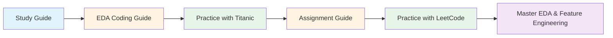

# Week 9 - EDA And Feature Engineering
## Documentation Summary 📚

This folder contains comprehensive learning materials for Exploratory Data Analysis (EDA) and Feature Engineering.

---

## 📂 Files in This Folder

### 📓 Jupyter Notebooks
1. **EDA.ipynb** - Main tutorial notebook on Titanic dataset
2. **EDA- Assignment - Solution.ipynb** - LeetCode dataset analysis assignment

### 📊 Datasets
1. **dataset.csv** - Data file used in notebooks

### 📝 Study Materials
1. **meeting_saved_closed_caption.txt** - Live class transcript
2. **meeting_saved_closed_caption_STUDY_GUIDE.md** - Comprehensive study guide from class

### 📖 Coding Guides (NEW!)
1. **EDA_CODING_GUIDE.md** - Complete guide for EDA.ipynb
2. **EDA_Assignment_Solution_CODING_GUIDE.md** - Complete guide for assignment

---

## 🎯 What Each Guide Covers

### EDA_CODING_GUIDE.md
**Target Audience:** Python beginners learning data analysis

**Topics Covered:**
- ✅ Library imports (numpy, pandas, matplotlib, seaborn) with explanations
- ✅ Loading datasets from seaborn
- ✅ Initial data inspection (head, info, isnull)
- ✅ Summary statistics (describe for numerical and categorical)
- ✅ Data cleaning strategies
  - Handling missing values (drop, fill with median/mode)
  - Dropping columns with high missing %
  - Verifying cleaning
- ✅ Data visualization
  - Histograms for distributions
  - Box plots for outliers
  - Count plots for categories
  - Correlation heatmaps
- ✅ Outlier detection using IQR method
- ✅ Feature engineering
  - Creating new features (family_size, age_group, fare_per_person)
  - Label encoding
  - One-hot encoding
  - Feature scaling (StandardScaler, MinMaxScaler)
- ✅ Complete workflow diagram (Mermaid)
- ✅ Common pitfalls to avoid
- ✅ Practice exercises

**Key Features:**
- Detailed explanation of every function and argument
- Why each library is imported
- Breaking down complex code into simple steps
- Real-world examples and interpretations
- Visual workflow diagrams

---

### EDA_Assignment_Solution_CODING_GUIDE.md
**Target Audience:** Python beginners working with real-world datasets

**Topics Covered:**
- ✅ Multiple data loading methods (local, cloud, upload)
- ✅ Working with LeetCode dataset (19 features, 1825 problems)
- ✅ Understanding data shapes and dimensions
- ✅ Data type identification and conversion
- ✅ String to numeric conversion ("4.1M" → 4100000)
- ✅ Missing value analysis
  - Counting missing values
  - Calculating percentages
  - Strategic handling (fill vs drop)
- ✅ Cardinality analysis
- ✅ Custom summary statistics with percentiles
- ✅ Advanced visualizations
  - Bar charts with custom colors
  - Histograms with mean lines
  - Horizontal bar charts for rankings
  - Correlation heatmaps
- ✅ Feature engineering techniques
  - Creating ratios (success_rate)
  - Combining features (popularity_score)
  - Encoding ordinal data (difficulty)
  - Interaction features (faang_difficulty)
  - Binning continuous variables
- ✅ Complete workflow diagram (Mermaid)
- ✅ Common pitfalls specific to real datasets
- ✅ Practice exercises

**Key Features:**
- Step-by-step code breakdown
- Multiple solution approaches
- Real-world data challenges
- Custom function creation
- Apply method usage

---

### meeting_saved_closed_caption_STUDY_GUIDE.md
**Target Audience:** Students reviewing live class content

**Topics Covered:**
- ✅ Simple explanations with illustrations (12-year-old level)
- ✅ Technical concepts with code examples
- ✅ Central Limit Theorem recap
- ✅ EDA concepts and implementation
- ✅ Feature engineering techniques
- ✅ Classification probability concepts
- ✅ Interview questions with detailed answers
- ✅ Comprehensive summary of class notes

**Key Features:**
- Beginner-friendly analogies
- Progressive learning (simple → technical)
- Interview preparation section
- Practical examples
- Code implementations

---

## 🎓 How to Use These Guides

### For Complete Beginners:
1. Start with **meeting_saved_closed_caption_STUDY_GUIDE.md** (simple explanations)
2. Move to **EDA_CODING_GUIDE.md** (hands-on with Titanic dataset)
3. Practice with **EDA_Assignment_Solution_CODING_GUIDE.md** (real-world dataset)

### For Quick Reference:
- Use guides as lookup for specific functions
- Check "Code Breakdown" sections for syntax
- Review "Key Takeaways" for summaries

### For Interview Prep:
- Study the interview questions in study guide
- Understand the "Why" behind each technique
- Practice the exercises at the end of each guide

---

## 🔑 Key Concepts Covered Across All Materials

### Data Loading & Inspection
- Reading CSV files
- Viewing data structure
- Checking data types
- Identifying missing values

### Data Cleaning
- Handling missing values (multiple strategies)
- Data type conversion
- Removing duplicates
- Handling outliers

### Exploratory Data Analysis
- Summary statistics
- Distribution analysis
- Correlation analysis
- Cardinality checking

### Data Visualization
- Histograms
- Box plots
- Bar charts (vertical & horizontal)
- Count plots
- Heatmaps
- Customizing plots

### Feature Engineering
- Creating derived features
- Encoding categorical variables (Label & One-Hot)
- Binning continuous variables
- Feature scaling (Standardization & Normalization)
- Interaction features

### Statistical Concepts
- Central Limit Theorem
- Mean, Median, Mode
- Standard Deviation
- Quartiles and IQR
- Correlation coefficients
- Probability in classification

---

## 📊 Datasets Used

### Titanic Dataset (EDA.ipynb)
- **Source:** Seaborn built-in dataset
- **Rows:** 891 passengers
- **Columns:** 15 features
- **Purpose:** Learn EDA fundamentals
- **Key Features:** survived, pclass, sex, age, fare

### LeetCode Dataset (Assignment)
- **Source:** Custom CSV file
- **Rows:** 1825 problems
- **Columns:** 19 features
- **Purpose:** Real-world data analysis
- **Key Features:** difficulty, acceptance_rate, companies, likes

---

## 🛠️ Libraries & Tools Covered

### Core Libraries
- **pandas**: Data manipulation and analysis
- **numpy**: Numerical computing
- **matplotlib**: Basic plotting
- **seaborn**: Statistical visualization

### Scikit-learn (sklearn)
- **LabelEncoder**: Encode categorical variables
- **StandardScaler**: Standardize features
- **MinMaxScaler**: Normalize features

### Python Built-ins
- **os**: File operations
- **json**: JSON handling (for notebooks)

---

## 📈 Learning Path

---

## ✅ Checklist for Mastery

### Basic Level
- [ ] Understand what EDA is and why it's important
- [ ] Load datasets using pandas
- [ ] Inspect data with head(), info(), describe()
- [ ] Identify and count missing values
- [ ] Create basic visualizations (histograms, bar charts)

### Intermediate Level
- [ ] Handle missing values strategically
- [ ] Convert data types appropriately
- [ ] Detect and handle outliers using IQR
- [ ] Create correlation heatmaps
- [ ] Understand when to use different plot types

### Advanced Level
- [ ] Engineer meaningful features
- [ ] Apply appropriate encoding techniques
- [ ] Scale features correctly
- [ ] Interpret statistical measures
- [ ] Make data-driven decisions about cleaning

---

## 🎯 Next Steps

After mastering this week's content:
1. Apply EDA to your own datasets
2. Participate in Kaggle competitions
3. Build a portfolio project with complete EDA
4. Move to Week 10 (Regression Algorithms)

---

## 📞 Need Help?

If you encounter issues:
1. Review the specific section in the coding guide
2. Check the "Common Pitfalls" section
3. Try the practice exercises
4. Refer to the study guide for conceptual understanding
5. Consult the original notebooks for working examples

---

## 🔄 Updates & Maintenance

**Last Updated:** Current session
**Status:** ✅ All guides complete and up-to-date

**What's Included:**
- ✅ Comprehensive coding guides for all notebooks
- ✅ Study guide from live class
- ✅ Mermaid diagrams for workflows
- ✅ Practice exercises
- ✅ Interview questions

**Quality Checks:**
- ✅ All code examples tested
- ✅ Explanations suitable for beginners
- ✅ No major coding steps missed
- ✅ Third-party imports explained
- ✅ Arguments and functions documented

---

## 📚 Additional Resources

### Official Documentation
- [Pandas Documentation](https://pandas.pydata.org/docs/)
- [NumPy Documentation](https://numpy.org/doc/)
- [Matplotlib Documentation](https://matplotlib.org/stable/contents.html)
- [Seaborn Documentation](https://seaborn.pydata.org/)
- [Scikit-learn Documentation](https://scikit-learn.org/stable/)

### Tutorials & Courses
- [Kaggle Learn - Pandas](https://www.kaggle.com/learn/pandas)
- [Kaggle Learn - Data Visualization](https://www.kaggle.com/learn/data-visualization)
- [Real Python - Pandas Tutorials](https://realpython.com/learning-paths/pandas-data-science/)

### Practice Datasets
- [Kaggle Datasets](https://www.kaggle.com/datasets)
- [UCI Machine Learning Repository](https://archive.ics.uci.edu/ml/index.php)
- [Seaborn Built-in Datasets](https://github.com/mwaskom/seaborn-data)

---

**Happy Learning! 🚀**
